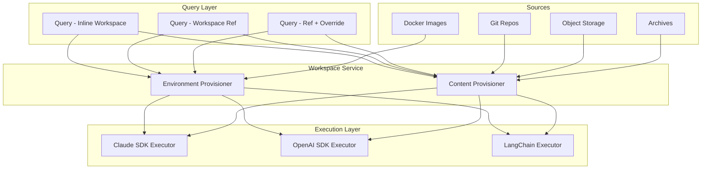
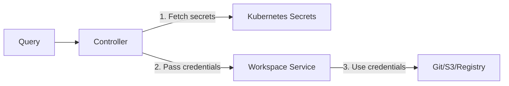
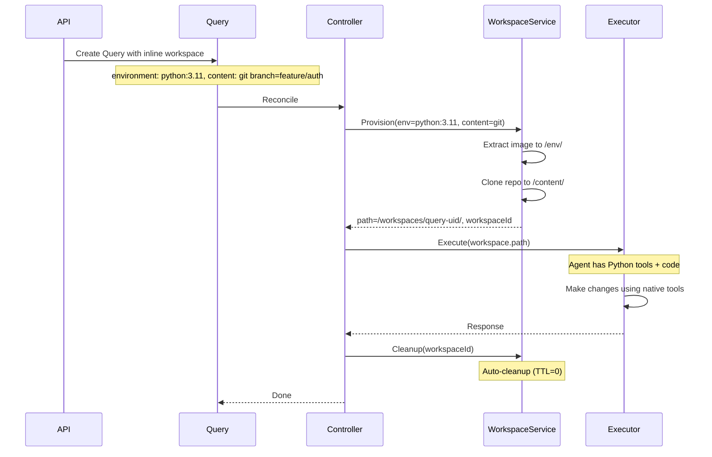
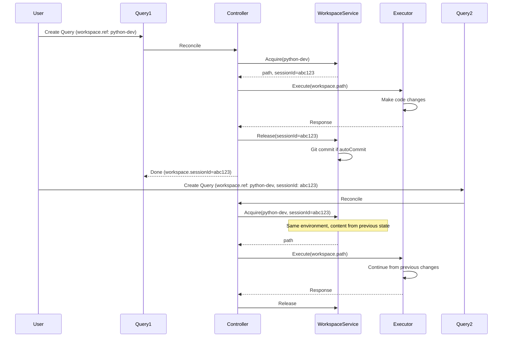
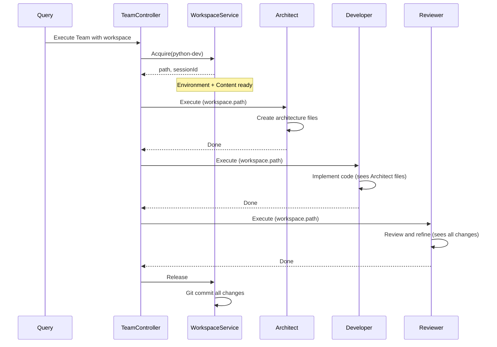

# Workspace CRD Architecture Design

## Overview

Design a workspace system with two distinct concepts:

1. **Environment**: Tools, binaries, and runtime from Docker images (read-only)
2. **Content**: Code, data, and working files from git, S3, archives, etc. (read-write)

Supports two usage patterns:

- **Inline Ephemeral**: Defined directly in Query spec, auto-cleanup (primary for API-driven workflows)
- **Workspace CRD**: Pre-defined, persistent workspaces for long-running sessions

## Core Concept: Environment + Content

```mermaid
flowchart TB
    subgraph workspace [Provisioned Workspace]
        subgraph env [Environment - Read Only]
            Bin[/bin/ - tools]
            Lib[/lib/ - libraries]
            Python[/python3.11/]
        end
        subgraph content [Content - Read/Write]
            Src[/src/ - code]
            Tests[/tests/]
            Data[/data/]
        end
    end

    Image[Docker Image] -->|Extract| env
    Git[Git Repo] -->|Clone| content
    S3[S3 Bucket] -.->|Alternative| content
    Archive[Archive URL] -.->|Alternative| content
    Empty[Empty Dir] -.->|Alternative| content
```

| Component   | Purpose                  | Source                  | Mutable             |
| ----------- | ------------------------ | ----------------------- | ------------------- |
| Environment | Tools, binaries, runtime | Docker image            | No (read-only)      |
| Content     | Code, data to work on    | Git, S3, archive, empty | Yes (if persistent) |

## Architecture Diagram



## Workspace Spec Structure

### Full Workspace Spec

```yaml
workspace:
  # Environment: tools and runtime (optional, read-only)
  environment:
    image:
      ref: python:3.11-slim
      sourcePath: /usr/local # Optional: extract specific path
    # OR reference pre-built environment
    workspaceRef:
      name: python-dev-tools

  # Content: code/data to work on
  content:
    git:
      url: "git@github.com:org/repo.git"
      branch: main
      authSecretRef:
        name: git-credentials
    # OR other content sources (see below)

  # Mount configuration
  mountPath: /workspace

  # Persistence (applies to content only, environment is always read-only)
  persistent: true # true = read-write, false = read-only

  # Lifecycle
  ttl: 0 # 0 = cleanup immediately, >0 = keep for duration

  # Storage
  storage:
    size: 5Gi
    storageClass: standard

  # Git writeback (only for git content + persistent: true)
  autoCommit:
    enabled: false
    message: "Changes by Ark agent"
    pushBranch: ""
```

### Content Source Types

**Git Repository** (primary):

```yaml
content:
  git:
    url: "git@github.com:org/repo.git"
    branch: main
    path: "" # Clone into subdirectory
    sparsePaths: [] # Sparse checkout paths
    depth: 0 # Clone depth (0 = full)
    authSecretRef:
      name: git-credentials
```

**Empty Directory**:

```yaml
content:
  empty: {}
```

**Object Storage**:

```yaml
content:
  objectStorage:
    provider: s3 # s3 | gcs | azure
    bucket: my-bucket
    prefix: projects/my-project/
    authSecretRef:
      name: s3-credentials
```

**Archive**:

```yaml
content:
  archive:
    url: "https://storage.example.com/project.tar.gz"
    format: tar.gz # tar.gz | zip
    authSecretRef:
      name: storage-credentials
```

## Query Workspace Configuration

Workspace mode is determined by which fields are present (discriminated union pattern):

- If `environment` or `content` is present → inline workspace
- If `ref` is present → reference to Workspace CRD

### Pattern 1: Inline Ephemeral (Primary - API-Driven)

```yaml
apiVersion: ark.mckinsey.com/v1alpha1
kind: Query
metadata:
  name: review-pr-123
spec:
  target:
    type: agent
    name: code-reviewer
  input: "Review this PR"

  workspace:
    environment:
      image:
        ref: python:3.11-slim
    content:
      git:
        url: "git@github.com:org/repo.git"
        branch: "feature/auth" # Set dynamically by API
        authSecretRef:
          name: git-credentials
    mountPath: /workspace
    persistent: true
    ttl: 0 # Cleanup after query
```

### Pattern 2: Reference Existing Workspace CRD

```yaml
apiVersion: ark.mckinsey.com/v1alpha1
kind: Query
spec:
  workspace:
    ref:
      name: my-project-workspace
    sessionId: "abc123" # Resume from previous session
```

### Pattern 3: Reference + Override (Dynamic Branch)

```yaml
apiVersion: ark.mckinsey.com/v1alpha1
kind: Query
spec:
  workspace:
    ref:
      name: python-code-review # Base workspace with environment
    overrides:
      content:
        git:
          branch: "feature/new-api" # Override just the branch
      autoCommit:
        pushBranch: "review/new-api"
```

### Pattern 4: Content Only (No Environment)

```yaml
apiVersion: ark.mckinsey.com/v1alpha1
kind: Query
spec:
  workspace:
    content:
      git:
        url: "git@github.com:org/repo.git"
        branch: "main"
    persistent: true
    ttl: 0
```

### Pattern 5: Environment Only (Tools, No Code)

```yaml
apiVersion: ark.mckinsey.com/v1alpha1
kind: Query
spec:
  workspace:
    environment:
      image:
        ref: python:3.11-slim
    content:
      empty: {} # Agent creates content
    persistent: true
    ttl: 1h
```

## Workspace CRD (Optional - For Persistent Workspaces)

```yaml
apiVersion: ark.mckinsey.com/v1alpha1
kind: Workspace
metadata:
  name: python-code-review
  namespace: default
spec:
  environment:
    image:
      ref: python:3.11-slim

  content:
    git:
      url: "git@github.com:org/repo.git"
      branch: main
      authSecretRef:
        name: git-credentials

  mountPath: /workspace
  persistent: true

  storage:
    size: 5Gi
    storageClass: standard
    accessMode: ReadWriteOnce

  ttl: 168h # 0 = no expiration

  autoCommit:
    enabled: false
    message: "Changes by Ark agent"
    pushBranch: ""
    userName: "Ark Agent"
    userEmail: "ark-agent@mckinsey.com"

status:
  phase: Ready
  path: /workspaces/python-code-review
  pvcName: workspace-python-code-review-pvc
  lastSynced: "2026-02-07T10:00:00Z"
  currentOwner: ""
  environmentStatus:
    image: python:3.11-slim
    ready: true
  contentStatus:
    type: git
    git:
      branch: main
      lastCommit: abc123
      dirty: false
  conditions:
    - type: Ready
      status: "True"
```

## Agent-Level Workspace (Default for Agent)

Agents can specify a default workspace:

```yaml
apiVersion: ark.mckinsey.com/v1alpha1
kind: Agent
metadata:
  name: code-reviewer
spec:
  workspace:
    ref:
      name: python-dev-tools # Default workspace for this agent
```

Query can override or extend the agent's default workspace.

## Persistence Model

| Setting             | Environment | Content    | Use Case                     |
| ------------------- | ----------- | ---------- | ---------------------------- |
| `persistent: true`  | Read-only   | Read-write | Development, iterative work  |
| `persistent: false` | Read-only   | Read-only  | Testing, reproducible builds |

- **Environment is always read-only**: Tools/binaries don't change during execution
- **Content persistence is configurable**: Code changes can persist or be discarded

## Concurrency Model

### Inline Workspaces (Ephemeral)

No concurrency issues - each query gets its own isolated workspace:

- Path: `/workspaces/ephemeral/{query-uid}/`
- Fully isolated, no locking needed
- Cleaned up after query completes

### Workspace CRD References

When multiple queries reference the same Workspace CRD:

| Scenario                                          | Behavior                                       |
| ------------------------------------------------- | ---------------------------------------------- |
| Query A running, Query B starts                   | Query B fails fast with `WorkspaceInUse` error |
| Query A running, Query B with `waitForLock: true` | Query B waits (with timeout)                   |
| Query A completes, Query B waiting                | Query B acquires workspace                     |

**Default behavior**: Fail fast with clear error message.

**Optional wait behavior**:

```yaml
workspace:
  ref:
    name: shared-workspace
  waitForLock: true
  lockTimeout: 5m # Max time to wait
```

**Lock tracking**:

- Workspace status tracks `currentOwner` (Query UID)
- Lock acquired on workspace acquire, released on workspace release
- Lock timeout prevents deadlocks from crashed queries

## Cleanup and Orphan Prevention

### Finalizer Pattern

Query resources use finalizers to guarantee cleanup:

```yaml
metadata:
  finalizers:
    - workspace.ark.mckinsey.com/cleanup
```

**Cleanup flow**:

1. Query marked for deletion → controller sees finalizer
2. Controller calls workspace-service to cleanup
3. Workspace-service deletes ephemeral workspace files
4. Controller removes finalizer
5. Query deleted

### Orphan Detection

Workspace-service runs periodic cleanup job:

1. List all ephemeral workspaces in `/workspaces/ephemeral/`
2. For each workspace, check if corresponding Query exists
3. If Query not found and workspace older than grace period (1h), delete

**Fallback TTL**: Ephemeral workspaces have a hard TTL (e.g., 24h) as safety net.

### Workspace CRD Cleanup

For Workspace CRDs:

- TTL field controls auto-deletion (0 = never)
- Controller deletes expired workspaces
- PVCs cleaned up when Workspace CRD deleted

## Secrets and Credentials Flow

### Architecture



### Flow

1. **Query references secrets** via `authSecretRef` in workspace config
2. **Controller fetches secrets** using its ServiceAccount (already has RBAC for secrets)
3. **Controller passes credentials** to workspace-service in provision request
4. **Workspace-service uses credentials** for git clone, S3 sync, image pull
5. **Credentials not stored** - only used for the operation, then discarded

### Security Considerations

- Secrets never stored in workspace-service (stateless)
- Credentials passed over internal cluster network (mTLS recommended)
- Controller ServiceAccount needs `get` permission on referenced secrets
- Workspace-service does not need direct secret access

### Example Secret Reference

```yaml
workspace:
  content:
    git:
      url: "git@github.com:org/private-repo.git"
      authSecretRef:
        name: git-credentials
        key: token # Key within the secret
```

## Observability

### Query Status Conditions

Workspace lifecycle reflected in Query status:

```yaml
status:
  conditions:
    - type: WorkspaceProvisioned
      status: "True"
      reason: Provisioned
      message: "Workspace provisioned at /workspaces/ephemeral/abc123"
    - type: WorkspaceReleased
      status: "True"
      reason: Released
      message: "Workspace cleaned up"
```

### Events

Controller emits events for key lifecycle moments:

| Event                    | When                             |
| ------------------------ | -------------------------------- |
| `WorkspaceProvisioning`  | Starting to provision workspace  |
| `WorkspaceProvisioned`   | Workspace ready for execution    |
| `WorkspaceAcquireFailed` | Failed to acquire (e.g., in use) |
| `WorkspaceReleaseFailed` | Failed to release/cleanup        |
| `WorkspaceReleased`      | Workspace successfully released  |

### Debugging

**Query status shows**:

- `workspace.id`: ID assigned by workspace-service
- `workspace.path`: Mount path in executor
- `workspace.sessionId`: For resuming persistent workspaces

**Workspace-service logs** include:

- Query UID for correlation
- Provisioning duration
- Git clone/checkout details
- Cleanup operations

## Component Architecture

### 1. Workspace Controller (Go)

New controller in `ark/internal/controller/workspace_controller.go`:

- Creates/manages PVCs for Workspace CRDs
- Handles TTL expiration
- Manages environment image extraction
- Tracks workspace phase and conditions

### 2. Workspace Service (New Service)

New service `services/workspace-service/` exposing REST API:

| Endpoint                   | Method | Description                                 |
| -------------------------- | ------ | ------------------------------------------- |
| `/workspaces/provision`    | POST   | Provision workspace (environment + content) |
| `/workspaces/{id}/acquire` | POST   | Acquire workspace for query                 |
| `/workspaces/{id}/release` | POST   | Release, finalize changes (git commit)      |
| `/workspaces/{id}/cleanup` | DELETE | Cleanup ephemeral workspace                 |
| `/workspaces/{id}/status`  | GET    | Get workspace status                        |

**Environment Provisioners:**

| Provisioner        | Operations                                   |
| ------------------ | -------------------------------------------- |
| `ImageProvisioner` | Pull Docker image, extract filesystem to PVC |

**Content Provisioners:**

| Provisioner                | Operations                      |
| -------------------------- | ------------------------------- |
| `GitProvisioner`           | Clone, pull, commit, push       |
| `EmptyProvisioner`         | Create empty directory          |
| `ArchiveProvisioner`       | Download and extract tar.gz/zip |
| `ObjectStorageProvisioner` | S3/GCS/Azure sync               |

### 3. Execution Engine Updates

Update `ExecutionEngineRequest` to include workspace info:

```go
type ExecutionEngineRequest struct {
    Agent     AgentConfig              `json:"agent"`
    UserInput ExecutionEngineMessage   `json:"userInput"`
    History   []ExecutionEngineMessage `json:"history"`
    Tools     []ToolDefinition         `json:"tools,omitempty"`
    Workspace *WorkspaceConfig         `json:"workspace,omitempty"`  // NEW
}

type WorkspaceConfig struct {
    Path           string `json:"path"`           // Mount path in executor
    SessionId      string `json:"sessionId"`      // For resuming work
    Persistent     bool   `json:"persistent"`     // Content is read-write
    HasEnvironment bool   `json:"hasEnvironment"` // Has tools from image
    HasGit         bool   `json:"hasGit"`         // Has git backing for content
}
```

### 4. Query Controller Updates

Update Query controller to:

1. Resolve workspace (inline or ref)
2. Call workspace-service to provision environment + content
3. Pass workspace config to execution engine
4. Release workspace after execution (cleanup or persist)
5. Handle git commit/push if configured

### 5. Executor Opt-In

Not all executors need workspace support:

| Executor   | Workspace Support | Notes                             |
| ---------- | ----------------- | --------------------------------- |
| Claude SDK | Full              | Native tool calling benefits most |
| OpenAI SDK | Full              | Agents SDK with code execution    |
| LangChain  | Optional          | Depends on tools configured       |

Executors without workspace support continue direct execution.

## Data Flow

### Inline Ephemeral Workspace (API-Driven)



### Multi-Round Conversation with Persistent Workspace



### Team Execution with Shared Workspace



## File Changes Summary

### New Files

| Path                                                   | Description                                    |
| ------------------------------------------------------ | ---------------------------------------------- |
| `ark/api/v1alpha1/workspace_types.go`                  | WorkspaceSpec with environment + content model |
| `ark/api/v1alpha1/workspace_crd_types.go`              | Optional Workspace CRD (Phase 5)               |
| `ark/internal/controller/workspace_controller.go`      | Workspace CRD reconciliation (Phase 5)         |
| `ark/internal/genai/workspace.go`                      | Workspace client interface                     |
| `services/workspace-service/`                          | Workspace provisioning service                 |
| `services/workspace-service/provisioners/environment/` | Image extraction provisioner                   |
| `services/workspace-service/provisioners/content/`     | Git, S3, archive, empty provisioners           |

### Modified Files

| Path                                          | Changes                                                 |
| --------------------------------------------- | ------------------------------------------------------- |
| `ark/api/v1alpha1/query_types.go`             | Add workspace field (discriminated: ref vs content/env) |
| `ark/api/v1alpha1/agent_types.go`             | Add optional default workspace reference                |
| `ark/internal/controller/query_controller.go` | Workspace provisioning and cleanup                      |
| `ark/internal/genai/execution_engine.go`      | Add WorkspaceConfig to request                          |
| `ark/internal/genai/team.go`                  | Pass workspace to all team members                      |
| `lib/ark-executor-common/base.py`             | Add WorkspaceConfig to request model                    |
| All executor services                         | Use workspace from request config                       |

## Migration Path

### Phase 1: Immediate Fix (No Breaking Changes)

Modify `lib/ark-executor-common/git.py` to use per-query isolation:

- Change workspace path to include query UID
- No CRD changes required
- Fixes current race conditions

### Phase 2: Workspace Types and Service

1. Define WorkspaceSpec with environment + content model
2. Create workspace-service with git content provisioner
3. Add workspace field to Query spec (inline pattern)
4. Query controller provisions ephemeral workspaces
5. Update ExecutionEngineRequest with WorkspaceConfig

### Phase 3: Environment Support

1. Add image provisioner for environment extraction
2. Support environment + content combination
3. Update executors to use workspace from request

### Phase 4: Additional Content Sources

1. Add S3, archive, empty content provisioners
2. Full inline workspace support

### Phase 5: Workspace CRD (Optional)

1. Add Workspace CRD for persistent workspaces
2. Add workspace.ref and workspace.overrides patterns
3. Workspace controller for PVC lifecycle

### Phase 6: Deprecation

1. Deprecate git- labels on Agents
2. Migration guide for existing users
3. Remove label-based git config after deprecation period

## Key Design Decisions

1. **Environment + Content Model**: Clear separation - tools (read-only) vs code (read-write)
2. **Discriminated Union Pattern**: Mode determined by presence of `ref` vs `environment`/`content` fields
3. **Inline-First Design**: Queries define workspaces inline (no CRD needed for common case)
4. **Dynamic Configuration**: Branch, path set at query time via API
5. **Simplified Model**: Single workspace per query, not an array
6. **Persistence Modes**: `persistent: true/false` controls content mutability
7. **Fail-Fast Concurrency**: Shared workspaces fail fast by default, optional wait with timeout
8. **Finalizer-Based Cleanup**: Guaranteed cleanup via Kubernetes finalizers + orphan detection
9. **Controller-Mediated Secrets**: Controller fetches secrets, passes to workspace-service (no direct access)
10. **Executor Opt-In**: Not all executors need workspace support
11. **Session IDs**: Enable resuming work from previous query state
12. **Backward Compatible**: Git labels continue to work during migration

## Use Case Summary

| Use Case               | Environment | Content              | Persistent | TTL  |
| ---------------------- | ----------- | -------------------- | ---------- | ---- |
| PR review (API-driven) | python:3.11 | git (dynamic branch) | true       | 0    |
| Code generation        | python:3.11 | empty                | true       | 0    |
| Testing/CI             | python:3.11 | git                  | false      | 0    |
| Multi-step refactoring | python:3.11 | git (Workspace CRD)  | true       | 168h |
| ML training            | -           | S3 bucket            | false      | 1h   |
| Agent collaboration    | python:3.11 | git (shared)         | true       | 168h |

## Sample Files

Sample YAML files to be created in `samples/workspaces/`:

### `query-inline-pr-review.yaml`

PR review with dynamic branch (API-driven):

```yaml
apiVersion: ark.mckinsey.com/v1alpha1
kind: Query
metadata:
  name: review-pr-123
spec:
  target:
    type: agent
    name: code-reviewer
  input: "Review the authentication changes in this PR"
  workspace:
    environment:
      image:
        ref: python:3.11-slim
    content:
      git:
        url: "git@github.com:myorg/myrepo.git"
        branch: "feature/auth-update"
        authSecretRef:
          name: git-credentials
    mountPath: /workspace
    persistent: true
    ttl: 0
```

### `query-inline-code-generation.yaml`

Code generation from scratch:

```yaml
apiVersion: ark.mckinsey.com/v1alpha1
kind: Query
metadata:
  name: generate-api-client
spec:
  target:
    type: agent
    name: code-generator
  input: "Generate a Python API client for the OpenAPI spec"
  workspace:
    environment:
      image:
        ref: python:3.11-slim
    content:
      empty: {}
    mountPath: /workspace
    persistent: true
    ttl: 0
    autoCommit:
      enabled: true
      message: "Generated API client"
      pushBranch: "generated/api-client"
```

### `query-inline-readonly.yaml`

Read-only analysis (testing/CI):

```yaml
apiVersion: ark.mckinsey.com/v1alpha1
kind: Query
metadata:
  name: analyze-codebase
spec:
  target:
    type: agent
    name: code-analyzer
  input: "Analyze the codebase for security vulnerabilities"
  workspace:
    environment:
      image:
        ref: python:3.11-slim
    content:
      git:
        url: "git@github.com:myorg/myrepo.git"
        branch: "main"
        authSecretRef:
          name: git-credentials
    mountPath: /workspace
    persistent: false
    ttl: 0
```

### `workspace-persistent.yaml`

Persistent Workspace CRD for multi-step workflows:

```yaml
apiVersion: ark.mckinsey.com/v1alpha1
kind: Workspace
metadata:
  name: refactoring-workspace
spec:
  environment:
    image:
      ref: python:3.11-slim
  content:
    git:
      url: "git@github.com:myorg/legacy-app.git"
      branch: "main"
      authSecretRef:
        name: git-credentials
  mountPath: /workspace
  persistent: true
  storage:
    size: 10Gi
    storageClass: standard
  ttl: 168h
  autoCommit:
    enabled: true
    message: "Refactoring changes"
    pushBranch: "refactor/cleanup"
    userName: "Ark Agent"
    userEmail: "ark-agent@example.com"
```

### `query-workspace-ref.yaml`

Query referencing persistent Workspace:

```yaml
apiVersion: ark.mckinsey.com/v1alpha1
kind: Query
metadata:
  name: refactoring-step-1
spec:
  target:
    type: agent
    name: refactoring-agent
  input: "Identify deprecated patterns in the codebase"
  workspace:
    ref:
      name: refactoring-workspace
```

### `query-workspace-ref-resume.yaml`

Resume from previous session:

```yaml
apiVersion: ark.mckinsey.com/v1alpha1
kind: Query
metadata:
  name: refactoring-step-2
spec:
  target:
    type: agent
    name: refactoring-agent
  input: "Replace the deprecated patterns you identified"
  workspace:
    ref:
      name: refactoring-workspace
    sessionId: "abc123-previous-session"
```

### `query-workspace-override.yaml`

Override branch on persistent Workspace:

```yaml
apiVersion: ark.mckinsey.com/v1alpha1
kind: Query
metadata:
  name: review-feature-branch
spec:
  target:
    type: agent
    name: code-reviewer
  input: "Review this feature branch"
  workspace:
    ref:
      name: refactoring-workspace
    overrides:
      content:
        git:
          branch: "feature/new-api"
      autoCommit:
        pushBranch: "review/new-api"
```

### `agent-default-workspace.yaml`

Agent with default workspace:

```yaml
apiVersion: ark.mckinsey.com/v1alpha1
kind: Agent
metadata:
  name: python-developer
spec:
  prompt: |
    You are a Python developer. Use the tools available in your workspace
    to write, test, and refactor Python code.
  modelRef:
    name: claude-sonnet
  executionEngineRef:
    name: claude-sdk
  workspace:
    ref:
      name: python-dev-environment
```

### `secret-git-credentials.yaml`

Git credentials secret:

```yaml
apiVersion: v1
kind: Secret
metadata:
  name: git-credentials
type: Opaque
stringData:
  token: "ghp_xxxxxxxxxxxx"
```

### `kustomization.yaml`

Kustomization for samples:

```yaml
apiVersion: kustomize.config.k8s.io/v1beta1
kind: Kustomization
resources:
  - secret-git-credentials.yaml
  - workspace-persistent.yaml
  - agent-default-workspace.yaml
  - query-inline-pr-review.yaml
  - query-inline-code-generation.yaml
  - query-inline-readonly.yaml
  - query-workspace-ref.yaml
  - query-workspace-ref-resume.yaml
  - query-workspace-override.yaml
```
