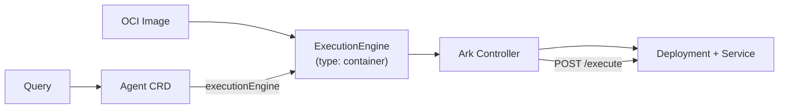

# Code-First Agents

Code-first agents let you write agent logic in any language and framework, package it as an OCI container, and deploy it through Ark. Your code receives model credentials, conversation history, and tools from Ark, giving you full flexibility while staying integrated with the platform.

## When to Use Code-First Agents

Use code-first agents when you need to:

- Use a specific SDK, framework or custom code
- Implement complex multi-step logic that goes beyond prompt + tools
- Integrate with external systems that require custom code
- Run proprietary or specialized agent implementations

For simple prompt-based agents, the standard [Agent](/user-guide/agents) resource is simpler.

## How It Works

A code-first agent uses two Ark resources:

1. **ExecutionEngine** (type: `container`) - Points to your OCI image. Ark deploys and manages the container as a Deployment + Service.
2. **Agent** - References the ExecutionEngine and provides model configuration.



When a Query targets your Agent, Ark resolves the model credentials, builds the request, and calls your container via HTTP.

## Quick Start

### 1. Implement the Executor Protocol

Create a Python file that extends `BaseExecutor`:

```python
from ark_executor_common import (
    BaseExecutor,
    ExecutionEngineRequest,
    ExecutorApp,
    Message,
    resolve_api_key,
    resolve_base_url,
)


class MyExecutor(BaseExecutor):
    async def execute_agent(self, request, trace_context=None):
        from openai import AsyncOpenAI

        client = AsyncOpenAI(
            api_key=resolve_api_key(request.agent.model),
            base_url=resolve_base_url(request.agent.model) or None,
        )

        messages = []
        if request.agent.prompt:
            messages.append({"role": "system", "content": request.agent.prompt})
        for msg in request.history:
            messages.append({"role": msg.role, "content": msg.content})
        messages.append({"role": request.userInput.role, "content": request.userInput.content})

        response = await client.chat.completions.create(
            model=request.agent.model.name,
            messages=messages,
        )

        return [
            Message(
                role="assistant",
                content=response.choices[0].message.content,
                name=request.agent.name,
            )
        ]


app = ExecutorApp(MyExecutor("my-agent"), "My Agent").create_app()
```

### 2. Package as a Container

```dockerfile
FROM python:3.12-slim
WORKDIR /app
COPY executor.py .
RUN pip install --no-cache-dir \
    ark-executor-common@git+https://github.com/mckinsey/agents-at-scale-ark.git@main#subdirectory=lib/ark-executor-common \
    openai
EXPOSE 8000
CMD ["uvicorn", "executor:app", "--host", "0.0.0.0", "--port", "8000"]
```

Build and push:

```bash
docker build -t ghcr.io/myorg/my-agent:latest .
docker push ghcr.io/myorg/my-agent:latest
```

### 3. Deploy to Ark

```yaml
apiVersion: ark.mckinsey.com/v1prealpha1
kind: ExecutionEngine
metadata:
  name: my-executor
spec:
  type: container
  container:
    image:
      ref: ghcr.io/myorg/my-agent:latest
    port: 8000
  timeout: "5m"
---
apiVersion: ark.mckinsey.com/v1alpha1
kind: Agent
metadata:
  name: my-code-agent
spec:
  modelRef:
    name: default
  executionEngine:
    name: my-executor
  prompt: You are a helpful assistant.
```

```bash
kubectl apply -f manifests.yaml
```

Ark creates a Deployment and Service for your container, wires the address, and marks the ExecutionEngine as ready.

### 4. Query Your Agent

```bash
fark agent my-code-agent "Hello, world!"
```

## Consuming Ark Models

Your code receives resolved model credentials in `request.agent.model`. Use the helpers from `ark-executor-common`:

```python
from ark_executor_common import resolve_api_key, resolve_base_url, resolve_model_properties

api_key = resolve_api_key(request.agent.model)
base_url = resolve_base_url(request.agent.model)
properties = resolve_model_properties(request.agent.model)
```

The model config includes all provider-specific fields (OpenAI, Azure, Bedrock) with secrets already resolved. You can plug these into any SDK.

## ExecutionEngine Container Spec

| Field                           | Type                 | Default  | Description                        |
| ------------------------------- | -------------------- | -------- | ---------------------------------- |
| `container.image.ref`           | string               | required | OCI image reference                |
| `container.image.pullSecretRef` | LocalObjectReference | -        | Secret for private registries      |
| `container.command`             | string[]             | -        | Override container entrypoint      |
| `container.args`                | string[]             | -        | Override container arguments       |
| `container.env`                 | EnvVar[]             | -        | Environment variables              |
| `container.resources`           | ResourceRequirements | -        | CPU/memory requests and limits     |
| `container.port`                | int                  | 8000     | Port serving the executor protocol |
| `container.replicas`            | int                  | 1        | Number of pod replicas             |
| `container.workspaceStorage`    | WorkspaceStorageSpec | -        | Workspace volume configuration     |

## Workspaces

To use [Workspaces](/developer-guide/workspaces) with a code-first agent, enable workspace storage:

```yaml
spec:
  type: container
  container:
    image:
      ref: ghcr.io/myorg/my-agent:latest
    workspaceStorage:
      enabled: true
```

Ark mounts the workspace PVC at `/workspaces` by default. To customize:

```yaml
    workspaceStorage:
      enabled: true
      mountPath: /data/workspaces       # default: /workspaces
      pvcName: my-custom-workspace-pvc  # default: workspace-service-pvc
```

| Field       | Type   | Default                | Description                     |
| ----------- | ------ | ---------------------- | ------------------------------- |
| `enabled`   | bool   | true                   | Mount the workspace PVC         |
| `mountPath` | string | /workspaces            | Path inside the container       |
| `pvcName`   | string | workspace-service-pvc  | PVC name to mount               |

When a Query includes a workspace, your executor receives `request.workspace` with the workspace path and metadata:

```python
async def execute_agent(self, request, trace_context=None):
    if request.workspace and request.workspace.path:
        import os
        files = os.listdir(request.workspace.path)
```

The `WorkspaceConfig` fields available in `request.workspace`:

| Field            | Type   | Description                                    |
| ---------------- | ------ | ---------------------------------------------- |
| `path`           | string | Filesystem path to workspace contents          |
| `sessionId`      | string | Session ID for persistent workspaces           |
| `persistent`     | bool   | Whether workspace persists across queries      |
| `hasEnvironment` | bool   | Whether workspace includes environment config  |
| `hasGit`         | bool   | Whether workspace has Git repository content   |

## The Executor Protocol

Your container must serve an HTTP API on the configured port:

### `GET /health`

Returns 200 when the executor is ready to accept requests.

### `POST /execute`

Receives an `ExecutionEngineRequest` JSON body and returns an `ExecutionEngineResponse`.

**Request:**

```json
{
  "agent": {
    "name": "my-code-agent",
    "namespace": "default",
    "prompt": "You are a helpful assistant.",
    "model": {
      "name": "gpt-4o",
      "type": "openai",
      "config": {
        "openai": {
          "apiKey": "sk-...",
          "baseUrl": "https://api.openai.com/v1"
        }
      }
    },
    "labels": {},
    "parameters": []
  },
  "userInput": {
    "role": "user",
    "content": "Hello!"
  },
  "history": [],
  "tools": []
}
```

**Response:**

```json
{
  "messages": [
    {
      "role": "assistant",
      "content": "Hello! How can I help you today?"
    }
  ],
  "token_usage": {
    "prompt_tokens": 10,
    "completion_tokens": 8,
    "total_tokens": 18
  }
}
```

### `POST /execute-stream` (optional)

SSE endpoint for streaming responses. Enable with `spec.streaming: true` on the ExecutionEngine.

## Telemetry

Code-first agents inherit the same OpenTelemetry integration as all Ark executors through `ark-executor-common`. The `ExecutorApp` automatically extracts trace context from incoming request headers and passes it to your `execute_agent()` method as `trace_context`.

To export traces, configure OTEL via environment variables on the container:

```yaml
spec:
  type: container
  container:
    image:
      ref: ghcr.io/myorg/my-agent:latest
    env:
      - name: OTEL_EXPORTER_OTLP_ENDPOINT
        value: "http://otel-collector:4317"
      - name: OTEL_SERVICE_NAME
        value: "my-agent"
```

Or reference a shared secret containing OTEL config:

```yaml
    env:
      - name: OTEL_EXPORTER_OTLP_ENDPOINT
        valueFrom:
          secretKeyRef:
            name: otel-environment-variables
            key: OTEL_EXPORTER_OTLP_ENDPOINT
            optional: true
```

Use `get_tracer()` from `ark-executor-common` to create spans within your executor:

```python
from ark_executor_common import get_tracer

tracer = get_tracer("my-agent")

async def execute_agent(self, request, trace_context=None):
    with tracer.start_as_current_span("my-operation", context=trace_context.context):
        # your logic here
        pass
```

## Private Registries

For images in private registries, create an image pull secret and reference it:

```yaml
spec:
  type: container
  container:
    image:
      ref: private-registry.example.com/my-agent:latest
      pullSecretRef:
        name: registry-credentials
```

## Development with DevSpace

For iterative development, use DevSpace to get hot-reload with live code sync:

```bash
cd samples/code-first/
devspace dev
```

This deploys your executor with file sync -- edit `executor.py` locally and uvicorn auto-reloads in the cluster. DevSpace creates the Deployment, Service, ExecutionEngine, and Agent using a Helm chart, so there's no image rebuild cycle during development.

The DevSpace config uses `address`-mode (DevSpace manages the Deployment), while the production `manifests.yaml` uses `container`-mode (Ark manages the Deployment). The executor code is identical in both modes.

## Examples

See `samples/code-first/` for a complete working example with both DevSpace and production workflows.
