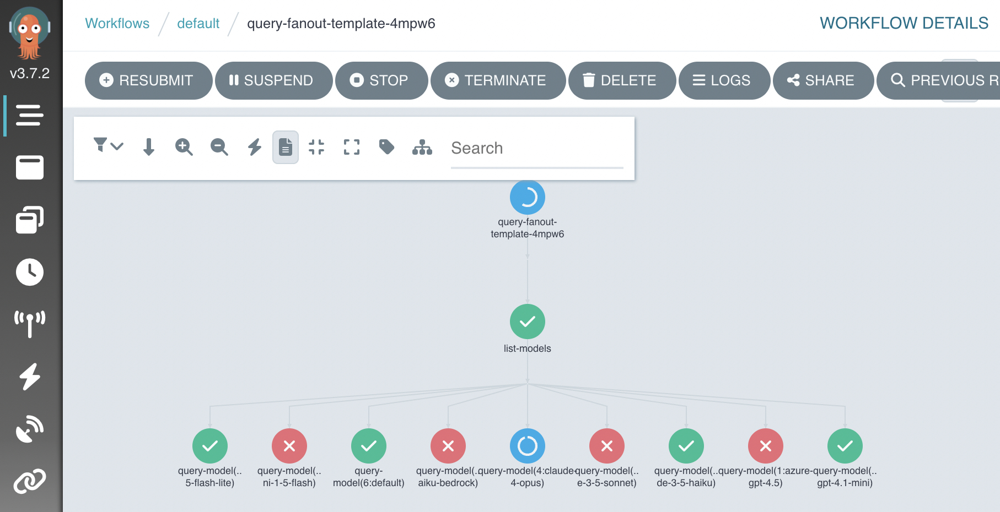

# Argo Workflows

[Argo Workflows](https://argoproj.github.io/) enables multi-step agent operations with parallel execution, conditional logic, and workflow visualization.

Charts that are preconfigured to enable Argo workflows on Ark are available so that you can rapidly build out use cases.

## Installation

This installs Argo in single-namespace mode within the Ark tenant namespace (typically `default` in development mode). Production installations will typically use a cross-tenant Argo operator with workflow execution distributed across Ark tenant namespaces.

Install via Helm, or for local development mode use `devspace`:

```bash
helm upgrade --install argo-workflows \
  oci://ghcr.io/mckinsey/agents-at-scale-ark/charts/argo-workflows

# Or for local development, use devspace:
cd services/argo-workflows
devspace dev

# Check status
kubectl get pods

# Port-forward to dashboard (this is done automatically when using devspace).
kubectl port-forward svc/argo-workflows-server 2746:2746
# Dashboard: http://localhost:2746
```

To uninstall:

```bash
# Uninstall a Helm installation.
helm uninstall argo-workflows

# Or purge if using devspace.
devspace purge
```

## Running Workflows

Start by creating a workflow or workflow template.

A sample template is provided that shows how to run Ark queries:

```bash
kubectl apply -f services/argo-workflows/samples/query-fanout-template.yaml
```

Open the Argo dashboard with at [`http://localhost:2746`](http://localhost:2746) and choose "Workflows > New Workflow > From Template > Query Fanout". The workflow will look something like this when running:



Workflows can also be run using the Argo CLI:

```bash
# List workflow templates if needed.
argo template list

# output:
# NAME
# query-fanout-template

# Run a workflow.
argo submit --from workflowtemplate/query-fanout-template \
  -p question="Describe how to monitor argo workflows from the command-line" \
  -p evaluator-model="default"

# Watch workflow progress
argo watch @latest

# View results, or status of all workflows.
argo logs @latest
argo list workflows
```

This workflow demonstrates how to run Ark and Argo operations:

1. Take input paramters
2. Lists Ark models
3. Fan-out a workflow into a step per model
4. Run Ark queries
5. Fan-in and evalate results (quality, token count, etc)

## Troubleshooting

When you get errors or unexpected results:

```bash
# List workflows
kubectl get workflows -n argo-workflows

# View logs
argo logs @latest -n argo-workflows
```
