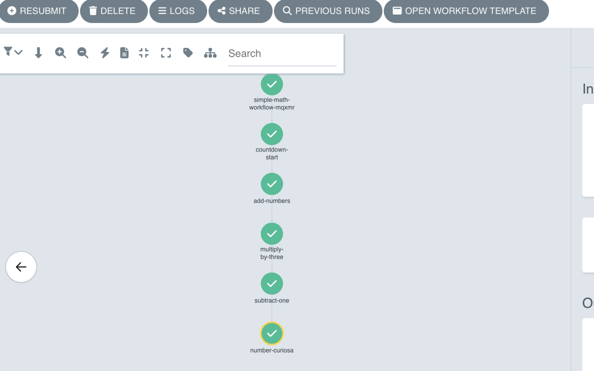

import { Callout } from 'nextra/components'

# Workflows

> **Workflows in Ark are [Argo Workflows](https://argoproj.github.io/workflows/).** Ark does **not** ship its own workflow engine — there's no native "Ark workflow" CRD and no drag-and-drop workflow builder. You author Argo `WorkflowTemplate` / `Workflow` YAML, and steps that need to interact with Ark Agents, Teams, Models and Tools do so by submitting a `Query` — usually by referencing the chart-provided `ark-query` template. Ark provides Helm charts and this reusable template to make those calls easy.

## Why Argo?

Argo is a battle-tested workflow engine for running complex, distributed workflows on Kubernetes. It's a good fit for orchestrating agentic processes with Ark because:

- **Enterprise-grade security** — standard Kubernetes patterns for services, RBAC, etc.
- **Cloud-native / portable** — runs on any Kubernetes environment.
- **Open source** — no vendor lock-in.
- **Battle-tested** — many years of production use.
- **Isolation** — containerised step execution is ideal for low-trust or isolated agentic operations.

> **Argo is a recommendation, not a requirement.** Ark agents and teams are API-callable (via the `Query` resource or the `ark` CLI), so any workflow engine that can run a container or make an HTTP/Kubernetes call can orchestrate them — for example [Temporal](https://temporal.io/). Argo is the engine Ark ships ready-made charts and the `ark-tools` image for; the patterns on this page apply to any engine.

## What the dashboard does (and doesn't) do

The Ark dashboard's **Workflow Templates** page is **read-only** — it lists the Argo `WorkflowTemplate`s in your namespace and renders their DAGs so you can see the shape of a pipeline. It is a *viewer*, not an editor:

- ✅ List templates, view details (entrypoint, steps), visualise the DAG (pan/zoom).
- ❌ No creating, editing, or composing workflows in the UI.

**All workflow authoring is YAML.** Write the `WorkflowTemplate`, `kubectl apply` it, and it appears in the dashboard for inspection and in Argo for execution.

## Installing

This installs Argo in single-namespace mode within the Ark tenant namespace (typically `default` in development).

```bash
helm upgrade --install argo-workflows \
  oci://ghcr.io/mckinsey/agents-at-scale-ark/charts/argo-workflows

# Or, for local development:
cd services/argo-workflows
devspace dev

# Check status
kubectl get pods -l app.kubernetes.io/part-of=argo-workflows

# Port-forward to the Argo dashboard (automatic when using devspace).
kubectl port-forward svc/argo-workflows-server 2746:2746
# Dashboard: http://localhost:2746
```

### Non-root workflow pods

Workflow pods run their `argoexec` init and wait containers from Argo's non-root executor image (`quay.io/argoproj/argoexec:<version>-nonroot`, UID 8737), which is [Argo's recommended setting](https://argo-workflows.readthedocs.io/en/latest/workflow-pod-security-context/#non-root-executor-image). Each step's own container keeps the user its image declares, so steps running as root or any other UID still work.

The tag is pinned in `services/argo-workflows/chart/values.yaml` under `argo-workflows.executor.image.tag` and must be bumped with the Argo subchart version. Set `runAsUser: 0` on the workflow pod security context to run the executor as root instead.

### Minio artifact storage

Argo can use Minio to store workflow artifacts (intermediate outputs, logs, data files) for passing data between steps or preserving outputs. First install the Minio Operator:

```bash
helm upgrade minio-operator operator \
  --install \
  --repo https://operator.min.io \
  --namespace minio-operator \
  --create-namespace \
  --version 7.1.1

kubectl get pods -n minio-operator
```

Then enable Minio in the Argo Workflows chart:

```bash
helm upgrade --install argo-workflows \
  oci://ghcr.io/mckinsey/agents-at-scale-ark/charts/argo-workflows \
  --set minio.enabled=true

# Or for local development (select 'true' when prompted to enable Minio):
cd services/argo-workflows
devspace dev

kubectl get tenant   # check Minio tenant status
```

### Adding the `ark-query` template to an existing Argo installation

The Ark `argo-workflows` chart ships a reusable `ark-query` `WorkflowTemplate`, a canonical building block that submits an Ark `Query` and returns its structured outputs. This can be referenced with `templateRef: {name: ark-query, template: query}`. The chart installs it automatically, so the steps above already give you everything. If you run your **own** Argo Workflows (installed separately from the Ark chart), add just this template.

The chart delivers the `WorkflowTemplate` inside a `ConfigMap` (a post-install hook Job applies it during a full chart install), so a standalone install renders the chart, extracts the `WorkflowTemplate` from that `ConfigMap` with [`yq`](https://github.com/mikefarah/yq), and applies it into the namespace where your workflows run:

```bash
helm template argo-workflows \
  oci://ghcr.io/mckinsey/agents-at-scale-ark/charts/argo-workflows \
  --show-only templates/ark-query-template.yaml \
  --namespace <your-argo-namespace> \
  | yq 'select(.kind == "ConfigMap") | .data["ark-query.yaml"]' \
  | kubectl apply -n <your-argo-namespace> -f -

# Verify the template is present.
kubectl get workflowtemplate ark-query -n <your-argo-namespace>
```

`WorkflowTemplate`s are namespace-scoped, so `ark-query` must live in the same namespace as the workflows that reference it. Applying the extracted `WorkflowTemplate` is idempotent - re-run the command to pick up template updates when you upgrade Ark.

## How a step calls Ark

The chart-provided `ark-query` `WorkflowTemplate` is the recommended way to call Ark from a step. Reference it with `templateRef` — it submits an Ark `Query`, waits for completion, and exposes the result as parameter outputs, so you don't hand-write any `kubectl` or CLI plumbing:

**Inputs**

| Parameter | Required | Default | Description |
| --- | --- | --- | --- |
| `target` | Yes | - | `type/name`, where type is `agent`, `team`, `model`, or `tool` (e.g. `agent/weather-agent`). |
| `input` | Yes | - | The message to send to the target. |
| `timeout` | No | `5m` | How long to wait for the Query to complete. |
| `parameters` | No | `[]` | JSON array of `{name,value}` objects. |
| `ttl` | No | (unset) | Time-to-live for the created Query. |
| `session-id` | No | `wf-<workflow-name>` | Session ID to associate with the Query. |
| `conversation-id` | No | (random UUID) | Conversation ID for the Query; a new one is generated per step run if unset. |
| `memory` | No | (unset) | Name of the Memory resource to use. |
| `query-name` | No | (auto-generated) | Name for the created Query. |
| `service-account` | No | (unset) | ServiceAccount the Query runs under. |

**Outputs**

| Output | Source | Description |
| --- | --- | --- |
| `response` | `.status.response.content` | The target's reply text. |
| `query-json` | full Query object | The complete Query resource as JSON. |
| `phase` | `.status.phase` | Final phase, either `done` or `error`. |
| `conversation-id` | `.status.conversationId` | Conversation ID for the Query. |

Steps need a ServiceAccount with RBAC to create Queries — the samples set `serviceAccountName: argo-workflow`, which the chart provisions. The `ark-query` template is namespace-scoped and must exist in the same namespace as your workflow; the chart installs it automatically (see [Adding the `ark-query` template](#adding-the-ark-query-template-to-an-existing-argo-installation) for standalone Argo installs). The examples below are Argo `step` snippets — drop them into a `WorkflowTemplate`'s `steps:` list.

### Invoke an agent

```yaml
- name: ask-agent
  templateRef:
    name: ark-query
    template: query
  arguments:
    parameters:
      - name: target
        value: "agent/weather-agent"
      - name: input
        value: "What's the forecast for London?"
```

Read the reply from `{{steps.ask-agent.outputs.parameters.response}}`.

### Invoke a team

Same shape — use a `team/` target:

```yaml
- name: ask-team
  templateRef:
    name: ark-query
    template: query
  arguments:
    parameters:
      - name: target
        value: "team/research-team"
      - name: input
        value: "Summarise the latest on EV battery chemistries."
```

### Invoke a tool

Tools take a JSON object matching their `inputSchema`, passed as the `input`:

```yaml
- name: call-tool
  templateRef:
    name: ark-query
    template: query
  arguments:
    parameters:
      - name: target
        value: "tool/get-coordinates"
      - name: input
        value: '{"city":"Paris"}'
```

### Add conversation and session IDs

To thread history across steps, give them the same `conversation-id` - steps that share a `conversation-id` read and persist to the same conversation, so a later step sees earlier turns. Left unset, each step gets a fresh random `conversation-id` and starts a new conversation. To group several steps under one session for telemetry, set `session-id`. The workflow name makes a convenient stable ID across steps:

```yaml
- name: ask-with-context
  templateRef:
    name: ark-query
    template: query
  arguments:
    parameters:
      - name: target
        value: "agent/assistant"
      - name: input
        value: "What's my name?"
      - name: conversation-id
        value: "{{workflow.name}}"   # shared thread → steps see each other's history
      - name: session-id
        value: "{{workflow.name}}"   # groups the steps for telemetry
```

On a standard install, a shared `conversation-id` threads history through the default `Memory` store; set the `memory` input as well only if you need a specific `Memory` resource. See [Run queries → Multi-turn conversations](/user-guide/queries#multi-turn-conversations) for the underlying behaviour. `session-id` groups steps for telemetry only - it does not make them share history; `conversation-id` is what threads history. See [Query → Conversation ID vs session ID](/reference/resources/query#conversation-id-vs-session-id) for what each identifier does and when to set it.

<Callout type="info">
When you need control the template doesn't expose (e.g. custom labels or other `Query` `spec` fields), submit a raw `Query` from a step instead: `kubectl apply` a `Query` CR, `kubectl wait --for=condition=Completed`, then read `.status.response.content`. The legacy [`fark`](https://github.com/mckinsey/agents-at-scale-ark/blob/main/images/ark-tools/README.md) CLI (`fark <agent|team|model|tool> <name> "<message>"` in the `ark-tools` image) also still works for quick one-shot calls. Use **`fark`**, not `ark`, inside a workflow pod — the `ark` CLI port-forwards to `ark-api`, which the `argo-workflow` ServiceAccount can't do.
</Callout>

## Example: agents, teams, and deterministic steps together

Real Ark workflows mix LLM steps (agents/teams) with plain deterministic steps (containers that transform data, gate on conditions, or format output). The marketplace [KYC demo bundle](https://github.com/mckinsey/agents-at-scale-marketplace/tree/main/demos/kyc-demo-bundle) is a good reference: four sequential team steps feeding a final deterministic processing step.

This condensed `WorkflowTemplate` shows the shape — a sequential pipeline where each step queries a different resource, and a final non-LLM step formats the result:

```yaml
apiVersion: argoproj.io/v1alpha1
kind: WorkflowTemplate
metadata:
  name: research-pipeline
  annotations:
    workflows.argoproj.io/description: "Agent → team → deterministic pipeline"
spec:
  entrypoint: main
  serviceAccountName: argo-workflow
  arguments:
    parameters:
      - name: topic
        value: "electric vehicle adoption in Europe"
  templates:
    - name: main
      steps:
        # Step 1 — an AGENT gathers raw material.
        - - name: research
            templateRef:
              name: ark-query
              template: query
            arguments:
              parameters:
                - name: target
                  value: "agent/research-agent"
                - name: input
                  value: "Research: {{workflow.parameters.topic}}"

        # Step 2 — a TEAM reviews and refines, seeing step 1's output.
        - - name: review
            templateRef:
              name: ark-query
              template: query
            arguments:
              parameters:
                - name: target
                  value: "team/review-team"
                - name: input
                  value: "Critique and tighten this research:\n{{steps.research.outputs.parameters.response}}"

        # Step 3 — a DETERMINISTIC step (no LLM) formats the final report.
        - - name: format
            template: format-report
            arguments:
              parameters:
                - name: body
                  value: "{{steps.review.outputs.parameters.response}}"

    # A plain container step — pure data transformation, no Ark call.
    - name: format-report
      inputs:
        parameters:
          - name: body
      script:
        image: alpine:3.19
        command: [sh]
        source: |
          echo "# Research Report"
          echo "Generated: $(date -u +%Y-%m-%dT%H:%M:%SZ)"
          echo
          echo "{{inputs.parameters.body}}"
```

## Running workflows

Apply a template, then run it from the Argo dashboard or the `argo` CLI:

```bash
kubectl apply -f research-pipeline.yaml

# Run from the CLI.
argo submit --from workflowtemplate/research-pipeline -p topic="EV adoption in Europe"

# Watch progress and read results.
argo watch @latest
argo logs @latest
argo list workflows
```

From the **Argo dashboard** (`http://localhost:2746`), choose **Workflows → New Workflow → From Template** and pick your template.

```bash
# List templates if needed.
argo template list
```

## Bundled samples

The Ark repo ships runnable templates under `services/argo-workflows/samples/`:

| Sample | Shows |
| --- | --- |
| `query-fanout-template.yaml` | List models, fan out a parallel query per model, fan in and compare (quality, token count). |
| `ark-tools-template.yaml` | Run a query via the `fark` CLI in a container and capture output. |
| `weather-workflow-template.yaml` | Sequential agent queries passing results between steps. |
| `a2a-arithmetic-workflow.yaml` | Combine A2A agents, Ark agents, and Python steps. |
| `minio-artifact-template.yaml` | Pass artifacts between steps via Minio. |

```bash
kubectl apply -f services/argo-workflows/samples/query-fanout-template.yaml
argo submit --from workflowtemplate/query-fanout-template \
  -p question="Describe how to monitor argo workflows from the command-line"
```


### A2A arithmetic workflow

`a2a-arithmetic-workflow.yaml` combines A2A agents, Ark agents, and Python scripts. Install [mock-llm](https://github.com/dwmkerr/mock-llm) with A2A support — it creates a `countdown-agent` that returns an A2A task counting down from a given number of seconds:

```bash
helm upgrade --install mock-llm oci://ghcr.io/dwmkerr/charts/mock-llm \
  --set ark.a2a.enabled=true

kubectl get a2aserver mock-llm-countdown
# NAME                   ADDRESS                                                 READY
# mock-llm-countdown     http://mock-llm:6556/a2a/agents/countdown-agent         true

kubectl apply -f services/argo-workflows/samples/a2a-arithmetic-workflow.yaml
argo submit --from workflowtemplate/a2a-arithmetic-workflow -p a="2" -p b="3"
```



For larger end-to-end examples (multi-team DAGs writing reports via the file-gateway), see the marketplace demo bundles: [kyc-demo-bundle](https://github.com/mckinsey/agents-at-scale-marketplace/tree/main/demos/kyc-demo-bundle) and [cobol-modernization-bundle](https://github.com/mckinsey/agents-at-scale-marketplace/tree/main/demos/cobol-modernization-bundle).

## Viewing templates in the Ark dashboard

Once applied, open **Workflow Templates** in the dashboard sidebar to inspect a template:

- **Template list** — name, description (from the `workflows.argoproj.io/description` annotation), creation time.
- **DAG visualisation** — nodes (steps), edges (dependencies), hierarchical top-to-bottom layout, pan and zoom.
- **Template info** — namespace, entrypoint, the available template definitions.

To *run* a template, use the Argo dashboard or the `argo` CLI — the Ark dashboard only visualises.

## Uninstalling

```bash
# Helm install
helm uninstall argo-workflows

# Or, if using devspace
devspace purge
```

By default the Argo chart does **not** remove the Argo CRDs, to avoid accidental data loss. (Re-installing into a different namespace will clash unless you remove them.) To delete all Argo CRDs — and every workflow, template, and related object:

```bash
kubectl get crd -o name | grep argoproj.io | xargs kubectl delete
```

If you enabled Minio:

```bash
helm uninstall minio-operator --namespace minio-operator
# Removing Minio CRDs deletes stored artifacts:
kubectl get crd -o name | grep min.io | xargs kubectl delete
```

## Troubleshooting

```bash
# List workflows
kubectl get workflows

# Logs for the latest run
argo logs @latest
```

If an Ark step fails, inspect the `Query` it created — workflows label them with the workflow name:

```bash
kubectl get queries -l workflow=<workflow-name>
kubectl get query <name> -o jsonpath='{.status.response.content}'
```

## Related

- [Run queries / chat with agents and teams](/user-guide/queries) — the `Query` resource these steps create.
- [`ark-tools` image](https://github.com/mckinsey/agents-at-scale-ark/blob/main/images/ark-tools/README.md) — the CLI image used in workflow steps.
- [Ark API — Generic Resources API](/reference/ark-apis#generic-resources-api) — access workflow templates via the API.
