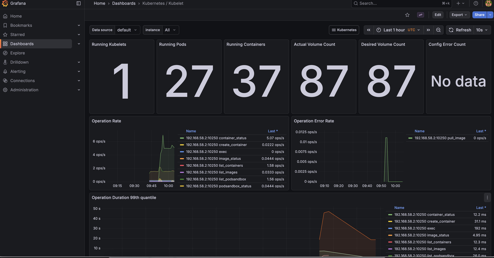

# Monitoring

ARK exposes Prometheus metrics from the controller. This guide covers setting up Prometheus and Grafana to monitor your ARK installation.

## Prerequisites

- Kubernetes cluster with ARK deployed
- Helm installed

## Install Prometheus stack

Install the kube-prometheus-stack which includes Prometheus, Grafana, and the ServiceMonitor CRD:

```bash
helm repo add prometheus-community https://prometheus-community.github.io/helm-charts
helm repo update

helm install prometheus prometheus-community/kube-prometheus-stack \
  --namespace monitoring --create-namespace \
  --set prometheus.prometheusSpec.serviceMonitorSelectorNilUsesHelmValues=false
```

The `serviceMonitorSelectorNilUsesHelmValues=false` setting allows Prometheus to discover ServiceMonitors in all namespaces.

## Install order

The Ark chart ships with `prometheus.enable: true`, but the ServiceMonitor is only rendered when the Prometheus Operator CRDs (`monitoring.coreos.com/v1`) already exist in the cluster. Helm evaluates this capability at install/upgrade time, so the ServiceMonitor is created only if Prometheus was installed **before** Ark. This keeps `helm install` working on clusters that do not run Prometheus, where the ServiceMonitor is simply skipped.

If you install Ark first and Prometheus second, the controller still serves metrics on its HTTPS endpoint, but nothing scrapes them and no ServiceMonitor exists yet:

```bash
kubectl get servicemonitor -n ark-system
# No resources found in ark-system namespace.
```

Re-run the Ark chart upgrade after the Prometheus Operator is present. The capability check then passes and the ServiceMonitor is created — no value changes are needed, since `--reuse-values` re-renders the chart against the cluster's updated capabilities:

```bash
# Release name and chart path match your original install.
helm upgrade ark-controller ./ark/dist/chart --reuse-values

kubectl get servicemonitor -n ark-system
# NAME                                      AGE
# ark-controller-manager-metrics-monitor    3s
```

## Verify metrics collection

Check that the ARK ServiceMonitor exists:

```bash
kubectl get servicemonitor -n ark-system
```

Port-forward to Prometheus and check the targets:

```bash
kubectl port-forward -n monitoring svc/prometheus-kube-prometheus-prometheus 9090:9090
```

Open http://localhost:9090/targets and verify ARK targets are being scraped.

## Access Grafana

Port-forward to Grafana:

```bash
kubectl port-forward -n monitoring svc/prometheus-grafana 3000:80
```

Open http://localhost:3000 and log in with:
- Username: `admin`
- Password: `prom-operator`



## TLS configuration

ARK uses cert-manager to secure metrics endpoints with TLS. The ServiceMonitor is configured to verify certificates rather than skip verification (`insecureSkipVerify: false`).

Ensure cert-manager is installed (included by default with `devspace dev`):

```bash
kubectl get pods -n cert-manager
```

## Available metrics

ARK exposes standard Kubernetes controller metrics including:
- Reconciliation counts and durations
- Work queue depth and latency
- Controller runtime metrics

Query these in Prometheus using the `controller_runtime_*` metric prefix.
