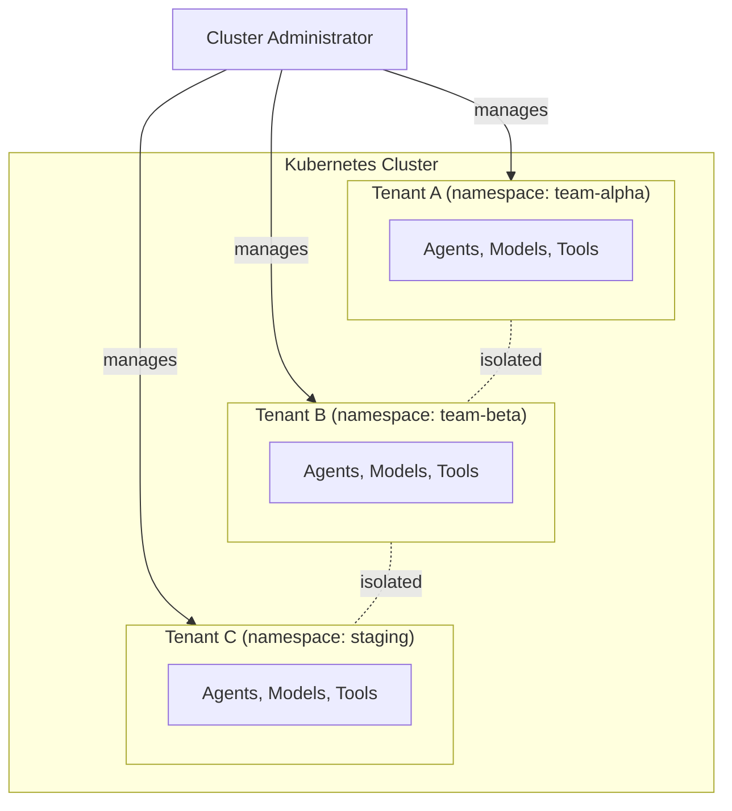

# Tenant and Namespace Management

Manage tenants, configure namespace access, and control multi-namespace RBAC in Ark.

## Tenant Isolation



Tenants are the fundamental isolation unit in Ark. Each tenant is a Kubernetes namespace containing its own agents, models, tools, and other Ark resources. Tenants can represent projects, teams, or environments.

By default, tenants are fully isolated from each other. A service account in one namespace cannot access resources in another. Cluster administrators manage tenants and can grant cross-namespace access via RBAC when needed.

## Default Single-Namespace Behaviour

Out of the box, each tenant operates entirely within its own namespace. No ClusterRole or ClusterRoleBinding is required. The `ark-tenant` Helm chart provisions everything needed:

- A service account with Ark resource permissions scoped to the namespace
- Builtin tools (`terminate`, `noop`) for agent workflows
- Optional resource quotas and network policies

This is sufficient for most single-team or single-project deployments.

## Setting Up Tenant Namespaces

The `ark-tenant` Helm chart provisions namespaces for Ark workloads:

```bash
helm install ark-tenant oci://ghcr.io/mckinsey/agents-at-scale-ark/charts/ark-tenant \
  -n tenant-1 \
  --create-namespace \
  --set serviceAccount.name=ark-tenant
```

This creates:
- The namespace (if it doesn't exist)
- The service account
- An `ark-tenant-role` with Ark and Kubernetes permissions
- A RoleBinding linking the service account to the role
- Builtin tools (`terminate`, `noop`) for agent workflows

Additional options include resource quotas and network policies, which are documented in the chart.

## Using the Tenant Service Account

Configure queries to use the service account:

```yaml
apiVersion: ark.mckinsey.com/v1alpha1
kind: Query
metadata:
  name: my-query
  namespace: tenant-1
spec:
  serviceAccount: ark-tenant
  input: "Hello from tenant-1"
  target:
    type: agent
    name: my-agent
```

When no service account is specified, the query runs with the controller's identity. This is suitable for development and single-tenant deployments.

> Note: Future releases will move query execution to per-namespace executor pods, eliminating the need for service account impersonation.

## Multi-Namespace RBAC

When tenants need access beyond their own namespace, apply one of these RBAC tiers. Sample manifests are in [`samples/tenant-management/`](https://github.com/mckinsey/agents-at-scale-ark/tree/main/samples/tenant-management).

| Manifest | Description | Use Case |
|---|---|---|
| [`01-namespace-reader.yaml`](https://github.com/mckinsey/agents-at-scale-ark/tree/main/samples/tenant-management/01-namespace-reader.yaml) | Namespace discovery | See available namespaces in dashboard |
| [`02-specific-namespaces.yaml`](https://github.com/mckinsey/agents-at-scale-ark/tree/main/samples/tenant-management/02-specific-namespaces.yaml) | Named namespace access | Access resources in specific namespaces |
| [`03-namespace-label-selector.yaml`](https://github.com/mckinsey/agents-at-scale-ark/tree/main/samples/tenant-management/03-namespace-label-selector.yaml) | Label-based access | Group namespaces by label convention |
| [`04-full-admin.yaml`](https://github.com/mckinsey/agents-at-scale-ark/tree/main/samples/tenant-management/04-full-admin.yaml) | Full cluster access | Platform administration |

### When to Use Each Tier

- **Namespace reader** — Start here if you want the dashboard namespace dropdown to list all namespaces. Read-only, no resource access.
- **Specific namespaces** — Use when a tenant needs to manage Ark resources in a known set of namespaces. Least-privilege for cross-namespace work.
- **Label-based access** — Use when namespaces are created dynamically and follow a labelling convention. Requires a RoleBinding in each labelled namespace.
- **Full admin** — Use only for platform administrators who need cluster-wide resource management and namespace creation.

> **Production note:** Never deploy the `ark-api` chart with cluster-wide permissions in production. Apply the minimum RBAC tier that meets your requirements.

## Dashboard Namespace Selector

The Ark dashboard sidebar includes a namespace dropdown that lists namespaces the current service account can access. The list is determined by RBAC permissions — only namespaces where the account has `get` or `list` access on namespaces appear.

When only the current tenant namespace is available (or none), the dropdown is disabled rather than hidden. This keeps the feature discoverable so users know multi-namespace support exists without needing documentation.

To enable namespace discovery across the cluster, apply the namespace reader ClusterRole from `01-namespace-reader.yaml`.
