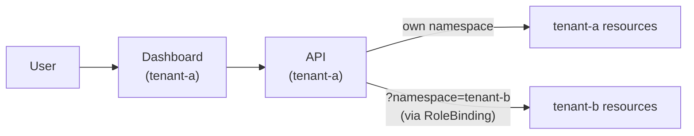

# Tenant and Namespace Management

Ark uses Kubernetes namespaces as tenants. Each namespace is an isolated environment with its own agents, models, tools, and queries. Isolation is enforced at the Kubernetes level via RBAC.

## Setting Up a Tenant

Set your kubectl context to the target namespace and use the Ark CLI to install:

```bash
kubectl create namespace tenant-a
kubectl config set-context --current --namespace=tenant-a
ark install ark-tenant
ark install ark-api
ark install ark-dashboard
```

`ark-tenant` declares `ark-broker` as a dependency, so the `ark install ark-tenant` above also installs the broker (per-tenant message, streaming, and session storage) first. The remaining two commands install the API layer and the dashboard, which you can then open with:

```bash
ark dashboard
```

> The Ark CLI uses your current kubectl context namespace. You can also install the charts directly with Helm — see the [Deploying Ark](/operations-guide/deploying-ark) guide.

A namespace without a broker silently loses conversation history: queries succeed, but the assistant never recalls a previous turn. To make that failure loud instead, a direct `helm install ark-tenant` refuses to install into a namespace with no broker Service. `ark install ark-tenant` never hits that refusal: it installs `ark-broker` first, and with `--no-deps` it passes `--set memory.requireBroker=false` so the tenant provisions without one. An existing tenant running `helm upgrade` is never blocked by the check either. Pass `--set memory.requireBroker=false` to a direct Helm install to provision a tenant without a broker anyway.

If a `Memory` named `default` already exists in the namespace from a previous manual setup, `ark install ark-broker` leaves it untouched rather than failing on ownership metadata, so it keeps pointing wherever it already pointed. Annotate and label it for Helm to adopt instead: `kubectl annotate memory default meta.helm.sh/release-name=ark-broker meta.helm.sh/release-namespace=<namespace> --overwrite && kubectl label memory default app.kubernetes.io/managed-by=Helm --overwrite`.

## Cross-Tenant Access

By default, tenants are fully isolated. A user accessing Tenant A's dashboard cannot see resources in Tenant B. A cluster administrator can grant cross-tenant access using standard Kubernetes RBAC.

### Example: Two Tenants with Cross-Access

Install two full tenants:

```bash
kubectl create namespace tenant-a
kubectl config set-context --current --namespace=tenant-a
ark install ark-tenant
ark install ark-api
ark install ark-dashboard

kubectl create namespace tenant-b
kubectl config set-context --current --namespace=tenant-b
ark install ark-tenant
ark install ark-api
ark install ark-dashboard
```

At this point both tenants are fully isolated. To grant Tenant A access to Tenant B's resources, apply a RoleBinding:

```yaml
apiVersion: rbac.authorization.k8s.io/v1
kind: RoleBinding
metadata:
  name: tenant-a-access
  namespace: tenant-b
subjects:
  - kind: ServiceAccount
    name: ark-api-sa
    namespace: tenant-a
roleRef:
  kind: Role
  name: ark-tenant-role
  apiGroup: rbac.authorization.k8s.io
```

A user on Tenant A's dashboard can now view and manage Tenant B's resources by adding `?namespace=tenant-b` to the URL.



Without the RoleBinding, the API returns a 403 error when attempting to access another tenant's resources.

## Namespace in the dashboard URL

The dashboard keeps the active namespace in the URL. Open it without `?namespace=`, and the namespace it resolved to is added to the address bar once the page loads. The URL therefore always names the namespace on screen.

This has three consequences:

- **Refreshing and bookmarking keep the namespace.** Before, a reload fell back to the pod's namespace.
- **Copying the URL shares the namespace.** Another user with the same access sees the same resources.
- **An unreachable namespace is corrected.** Open a URL naming a namespace you cannot access and the dashboard reports it, switches to the namespace it can use, and replaces the value in the URL to match. A bookmark naming a namespace you have lost access to rewrites itself, so read the notification rather than the address bar to learn what changed.

The namespace is added with a history replacement, so it creates no extra browser history entry and the back button is unaffected. Deployments served under a base path keep their prefix — see [Multi-tenant dashboard hosting](/operations-guide/multi-tenant-dashboard-hosting).

## Broker storage isolation

The cross-tenant isolation above applies to Kubernetes resources and is enforced by RBAC. The broker's message storage is a separate concern. The broker is a per-tenant component — each tenant namespace runs its own broker — while only the controller is a cluster-wide singleton.

When the broker uses the default in-memory message store, each broker pod holds its own messages, so isolation follows the deployment. With the Postgres message backend (`backends.message: postgres`) the `messages` table has no `tenant_id` column and no row-level security — its columns are `sequence_number`, `conversation_id`, `query_id`, `message`, `created_at`, and `expires_at`. Data isolation between tenants therefore depends entirely on the deployment, not on the data.

The Postgres event backend (`backends.event: postgres`) has the same property: the `events` table has no `tenant_id` column, and it shares the same `DATABASE_URL` and database as the messages backend. So does the sessions backend (`backends.sessions: postgres`), which adds the `sessions` and `session_queries` tables to that same database. Each per-tenant broker must point at its own database (or at least its own schema) with its own credentials. Do not share one `DATABASE_URL` across brokers of different tenants — their messages, events, and sessions would be commingled in the same tables with no way to separate them after the fact.

The same applies to the Redis chunks backend (`backends.chunk: redis`): chunk streams carry no per-tenant separation, and `REDIS_KEY_PREFIX` namespaces keys but is not an isolation boundary. Each per-tenant broker must point at its own Redis instance (or keyspace) with its own credentials — never share one `REDIS_URL` across brokers of different tenants. Traces remain in memory regardless of backend.

See [Message backend (Postgres)](/developer-guide/services/ark-broker#message-backend-postgres), [Event backend (Postgres)](/developer-guide/services/ark-broker#event-backend-postgres), and [Chunk backend (Redis)](/developer-guide/services/ark-broker#chunk-backend-redis) for backend configuration.

## Developing with Tenants

During development, use devspace to deploy into a tenant namespace:

```bash
devspace dev -n tenant-a
```

Or set your kubectl context and use the CLI:

```bash
kubectl config set-context --current --namespace=tenant-a
ark dashboard
```

Add `?namespace=tenant-b` to the URL to view another tenant's resources.
