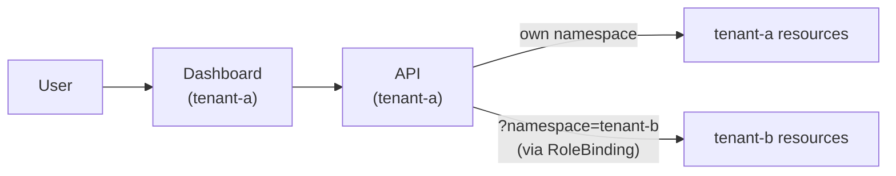

# Tenant and Namespace Management

Ark uses Kubernetes namespaces as tenants. Each namespace is an isolated environment with its own agents, models, tools, and queries. Isolation is enforced at the Kubernetes level via RBAC.

## Setting Up a Tenant

The `ark-tenant` Helm chart provisions a namespace with the service account, roles, and builtin tools needed to run Ark workloads:

```bash
helm install tenant-a oci://ghcr.io/mckinsey/agents-at-scale-ark/charts/ark-tenant \
  -n tenant-a --create-namespace
```

This creates a namespace-scoped service account, an `ark-tenant-role` with Ark resource permissions, and builtin tools for agent workflows.

## Cross-Tenant Access

By default, tenants are fully isolated. A user accessing Tenant A's dashboard cannot see resources in Tenant B. A cluster administrator can grant cross-tenant access using standard Kubernetes RBAC.

### Example: Granting Tenant A Access to Tenant B

First, install two tenants:

```bash
helm install tenant-a oci://ghcr.io/mckinsey/agents-at-scale-ark/charts/ark-tenant \
  -n tenant-a --create-namespace

helm install tenant-b oci://ghcr.io/mckinsey/agents-at-scale-ark/charts/ark-tenant \
  -n tenant-b --create-namespace
```

Then apply a RoleBinding in `tenant-b` that grants Tenant A's service account access:

```yaml
apiVersion: rbac.authorization.k8s.io/v1
kind: RoleBinding
metadata:
  name: tenant-a-access
  namespace: tenant-b
subjects:
  - kind: ServiceAccount
    name: ark-api-sa
    namespace: tenant-a
roleRef:
  kind: ClusterRole
  name: ark-tenant-role
  apiGroup: rbac.authorization.k8s.io
```

Once applied, a user on Tenant A's dashboard can switch to view and manage resources in Tenant B by adding `?namespace=tenant-b` to the URL.



Without the RoleBinding, the API returns a 403 error when attempting to access another tenant's resources.

## Developing with Tenants

To run Ark services in a specific tenant namespace during development:

```bash
devspace dev -n tenant-a
```

The Ark CLI uses your current kubectl context namespace. To open the dashboard for a tenant:

```bash
kubectl config set-context --current --namespace=tenant-a
ark dashboard
```

Add `?namespace=tenant-b` to the URL to view another tenant's resources.
