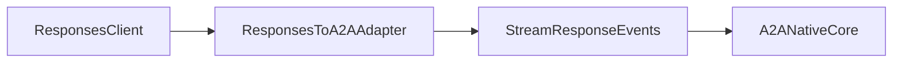
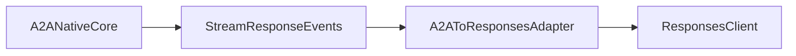

# A2A Task Streaming + Responses API Primer

This is a short follow-on to [A2A Native Execution](/reference/a2a-native-execution).

It describes conversion at **edge adapters** only:
- Keep Ark internal execution in native A2A format.
- Convert between A2A and OpenAI Responses API at the boundary.
- Preserve identifiers and task/message semantics to avoid lossy behavior.

## Version Assumptions

- Runtime interoperability baseline is **A2A v0.3**.
- V1 RC support is adapter-scoped.
- Streaming/event parsers may read both v0.3 and V1-style shapes, but serializers should emit an explicit configured shape.

## A2A Streaming Essentials

Per the A2A spec, `SendStreamingMessage` returns a `StreamResponse` envelope and follows one of two patterns:

1. **Message-only stream**
   - Stream emits a single `Message`
   - Stream closes immediately

2. **Task lifecycle stream**
   - Stream starts with `Task`
   - Followed by zero or more `TaskStatusUpdateEvent` and `TaskArtifactUpdateEvent`
   - Stream closes when task reaches terminal state

For Ark query streaming, treat the task lifecycle stream as canonical. Message-only streaming remains valid for non-task interactions.

`StreamResponse` is a typed wrapper with one payload per event:
- `task`
- `statusUpdate`
- `artifactUpdate`
- `message`

For versioning, treat stream decode as dual-shape:

- v0.3-style payloads may include discriminator fields such as `kind` and optional `final`.
- V1-style payloads rely on wrapper member presence and stream closure for completion.

For compatibility adapters, preserve the original event order and terminal closure semantics.

## Conversion Mapping (A2A to/from Responses API)

Use this as adapter guidance. A2A remains canonical internally.

| A2A construct | Responses API construct | Adapter notes |
| --- | --- | --- |
| `Task` (initial stream object) | Response lifecycle start state | Emit a lifecycle-start event and carry `taskId`/`contextId` in correlation metadata |
| `TaskStatusUpdateEvent` | Progress/status events | Map state transitions to response progress updates without collapsing intermediate states |
| `TaskArtifactUpdateEvent` | Incremental output chunk events | Preserve append/chunk semantics and artifact identity while emitting output deltas |
| `Message` (`role`, `parts[]`) | Response input/output message content items | Map each A2A part to one response content item; preserve part order and media type metadata |
| `contextId` and `taskId` | Response/session/thread/correlation IDs | Maintain stable ID mapping through adapter metadata; do not regenerate IDs mid-stream |
| `messageId` | Request/idempotency correlation ID | Preserve when present; populate when missing on outbound A2A requests |

## Lossless Conversion Rules

For predictable behavior across both protocols:

- **Part fidelity**: never flatten `parts[]` to a single string when structured/file parts are available.
- **Ordering fidelity**: stream events and content items must keep original order.
- **ID fidelity**: preserve `messageId`, `taskId`, and `contextId` across both directions.
- **State fidelity**: keep task lifecycle transitions explicit; do not compress to only start/end.
- **Metadata fidelity**: preserve extension metadata used for delegation and correlation (for example `https://ark.mckinsey.com/extensions/delegated-tool/v1`).

## Data Flow

### Inbound: Responses API stream -> A2A task stream

### Outbound: A2A task stream -> Responses API stream

## Ark Status and Follow-on Work

| Area | Status |
| --- | --- |
| Native A2A task streaming path | Implemented (default) |
| Task-first delegated streaming + correlation extension | Implemented |
| V1 adapter boundary contracts | Documented in [A2A Native Execution](/reference/a2a-native-execution#adapter-boundary-contracts) |
| OpenAI Responses API adapter | Planned (tracked in issue #965) |

A2A-native task streaming is the default. Responses API support should be implemented as an edge adapter, not as internal transport replacement.

## References

- [A2A Native Execution](/reference/a2a-native-execution)
- [A2A Protocol Specification](https://raw.githubusercontent.com/a2aproject/A2A/main/docs/specification.md)
- [Issue #965: Response API adapter](https://github.com/mckinsey/agents-at-scale-ark/issues/965)
