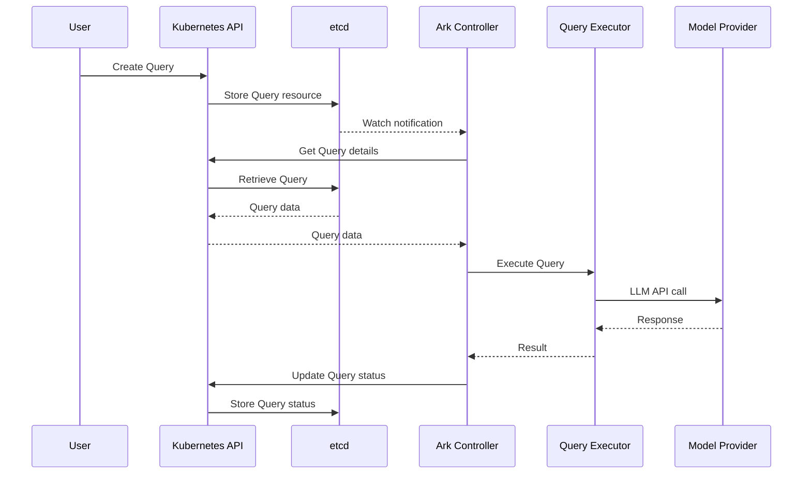
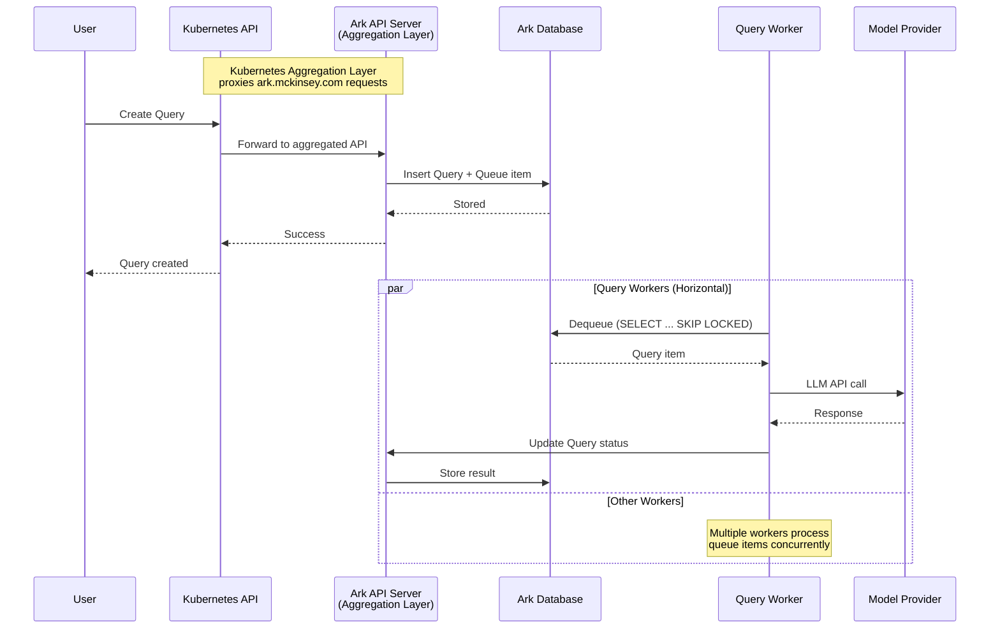

# Core Architecture

This page describes the current architecture of Ark and the planned aggregated architecture that addresses scalability concerns.

## Current Architecture

The current Ark deployment consists of:

- **Ark Core (Controller)**: Go-based component with metrics, webhook, and controller modules
- **Kubernetes API Server**: Handles standard Kubernetes and Ark custom resources
- **etcd**: Stores all Kubernetes resources including Ark custom resources (Agents, Models, Queries, etc.)

All Ark resources are stored in etcd alongside standard Kubernetes resources. Query execution is handled by the controller module, which scales vertically but has limitations for high-concurrency query workloads.

### Current Query Execution Flow

In the current architecture, queries are processed sequentially by controller reconciliation loops. This limits horizontal scalability for query workloads.

## Aggregated Architecture

The aggregated architecture uses **Kubernetes aggregation layer** to introduce a dedicated data layer for Ark resources with horizontal query processing.

### Kubernetes Aggregation Layer

The [Kubernetes aggregation layer](https://kubernetes.io/docs/concepts/extend-kubernetes/api-extension/apiserver-aggregation/) allows extending the Kubernetes API with additional API servers. The Ark apiserver registers itself as an aggregated API server, handling all `ark.mckinsey.com` API group requests while the main Kubernetes API server handles standard resources.

When a user creates an Ark resource (Query, Agent, Model, etc.), the Kubernetes API server proxies the request to the Ark apiserver, which stores data in Postgres instead of etcd.
 

### Components

- **Ark Core**: Enhanced with ark-apiserver and query-workers modules
  - **metrics module**: Exposes metrics
  - **webhook module**: Validates Ark resources
  - **controller module**: Reconciles Ark resources (leader-elected)
  - **ark-apiserver module**: Registered as Kubernetes aggregated API server, handles all Ark custom resources
  - **query-workers module**: Processes query queue items (horizontally scalable)
- **Kubernetes API Server**: Handles standard Kubernetes resources, proxies `ark.mckinsey.com` API requests to ark-apiserver
- **etcd**: Stores standard Kubernetes resources only (Ark resources no longer stored here)
- **Ark Database (Postgres)**:
  - Sits behind ark-apiserver
  - Stores all Ark custom resources (Agents, Models, Queries, etc.)
  - Manages query queue with SKIP LOCKED support

### Aggregated Query Execution Flow

### Horizontal Scalability

The aggregated architecture enables:

- **Ark Core replicas**: One leader (reconciliation), multiple non-leaders (webhooks, metrics, apiserver, query workers)
- **Query workers**: Multiple workers dequeue and process queries concurrently using database-level locking
- **Database replicas**: Postgres replication for read scalability

### Benefits

- **Kubernetes-native extension**: Uses standard Kubernetes aggregation layer pattern for seamless API integration
- **Better scalability**: Postgres handles Ark resource storage more efficiently than etcd for large datasets
- **Horizontal query processing**: Multiple query workers process queries concurrently from a shared queue
- **Rich querying**: SQL indexes, triggers, foreign keys enable complex queries across conversations, sessions, messages, and chunks
- **Enhanced observability**: Database schema supports advanced session UI and observability views
- **etcd relief**: Reduces load on etcd by storing only core Kubernetes resources
