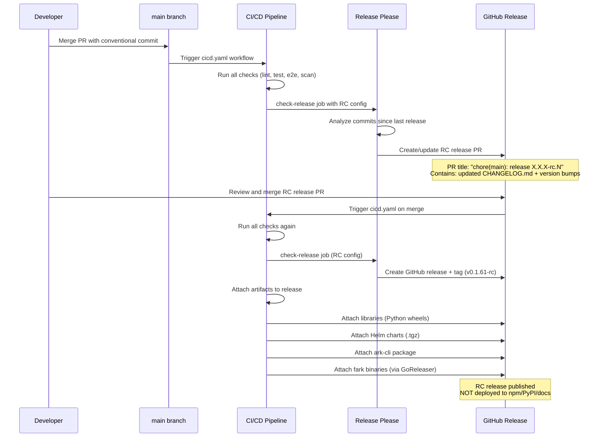

# Release Process and Artifacts

This page documents Ark's release process, published artifacts, and configuration item (CI) management. It serves as both an operator reference and a citable statement of practice for audits.

Ark uses a dual-track release process:
- **RC releases** — Continuous pre-release versions published from `main` by Release Please, tested in non-production environments
- **Stable releases** — A specific tested RC promoted to stable via a reviewed `release: vX.Y.Z` PR, with full publishing to registries (npm, PyPI, GitHub Pages)

## Release Process Overview

Ark uses [Release Please](https://github.com/googleapis/release-please) to drive the RC cycle. Stable releases use a custom promotion flow (`prepare-release.yaml` + `release-on-merge.yaml`) that promotes a **specific tested RC commit** rather than whatever is on `main` HEAD, so post-RC commits never leak into a stable release. The process is fully automated through GitHub Actions, requiring only merge approval at key decision points.

### Key Concepts

**Release Please** analyzes conventional commits on `main` and automatically:
- Determines semantic version bumps based on commit types (`feat:`, `fix:`, `BREAKING CHANGE:`)
- Creates release PRs with updated changelogs and synchronized versions across all artifacts
- Tags releases and triggers downstream deployment jobs

**RC configuration** drives the pre-release track:
- `.github/release-please-config-rc.json` — Generates pre-release versions (e.g., `v0.1.61-rc`, `v0.1.61-rc.1`)
- `.github/release-please-config.json` — Stable config, retained for the fallback promotion path (see [Fallback: Release Please promotion](#fallback-release-please-promotion))

**Stable promotion** does not use Release Please. `scripts/stamp-version.sh` strips the `-rc` suffix across every version file, and a reviewed `release: vX.Y.Z` PR carries that change plus a `.releasing` file recording the exact RC commit to build from.

**Version synchronization** ensures consistency across all artifacts. During the RC cycle, Release Please updates versions in:
- Root `version.txt` and `ark/version.txt`
- Python packages: 3 `pyproject.toml` files (ark-sdk, ark-api, overlay)
- Helm charts: 8 `Chart.yaml` files with both `version` and `appVersion` fields
- Node.js packages: `package.json` for ark-cli, ark-broker, docs site
- Kubernetes manifests: `ark/config/manager/manager.yaml`
- Marketplace metadata: `.claude-plugin/marketplace.json`

Total: 42+ tracked files across the monorepo.

## RC Release Cycle

The RC cycle runs continuously as changes merge to `main`. RC releases are published to GitHub with attached artifacts but not to public registries (npm, PyPI, docs site).



### RC Release Steps

1. **Continuous Development**
   - Changes merge to `main` with conventional commit messages (`feat:`, `fix:`, `docs:`, etc.)
   - Each merge triggers the full CI/CD pipeline (`.github/workflows/cicd.yaml`)

2. **Release PR Creation** (Automatic)
   - After all CI checks pass, the `check-release` job runs
   - Release Please (with RC config) analyzes commits since last release
   - Creates or updates a release PR titled `chore(main): release X.X.X-rc.N`
   - PR contains:
     - Updated `.github/CHANGELOG.md` with all changes since last release
     - Version bumps across all 58+ tracked files in the monorepo
   - Version format: `v0.1.61-rc` for first RC, `v0.1.61-rc.1`, `v0.1.61-rc.2` for subsequent iterations

3. **Release PR Review and Merge** (Manual approval required)
   - Team reviews the changelog and version updates
   - Merge the release PR (requires CODEOWNERS approval per repository ruleset)

4. **RC Artifact Publishing** (Automatic on merge)
   - CI/CD pipeline runs again on the merge commit
   - `check-release` job detects that the merge was a Release Please PR
   - Creates GitHub release with tag (e.g., `v0.1.61-rc`)
   - Attaches artifacts to the GitHub release:
     - **Python wheels** — 3 packages built from `lib/` and `services/` (job: `release-libs`)
     - **Helm charts** — 8 packaged charts as `.tgz` files (job: `release-charts`)
     - **ark-cli package** — npm tarball (job: `release-ark-cli`)
     - **fark binaries** — Linux/macOS/Windows builds with checksums (job: `release-fark`)
   - **Does NOT** publish to public registries (npm, PyPI) or deploy documentation site

5. **RC Testing** (Manual)
   - Install the RC version in test environments:
     ```bash
     ark install --ark-version 0.1.61-rc
     ```
   - Run validation tests, integration tests, and smoke tests
   - Gather feedback from early adopters

6. **Iteration** (Repeat as needed)
   - Additional changes merge to `main` (bug fixes, minor improvements)
   - Release Please creates `v0.1.61-rc.1`, then `v0.1.61-rc.2`, etc.
   - Each iteration follows steps 2-5
   - Multiple RC versions can be released for the same base version

## Stable Release Cycle

The stable release cycle promotes a **specific tested RC commit** to a stable release with full publishing to all registries. It does not use Release Please: promotion is a reviewed `release: vX.Y.Z` PR, and the shipped artifacts are rebuilt from the RC commit stamped with the stable version. This means:

- **No post-RC drift ships** — artifacts are built from the exact RC commit that was tested, not from `main` HEAD.
- **Works with branch protection, no PAT required** — every git ref (branch, tag) is created at `main` HEAD, so the default `GITHUB_TOKEN` can push.

```mermaid
sequenceDiagram
    participant Ops as Operator
    participant Prep as prepare-release.yaml
    participant Main as main branch
    participant Merge as release-on-merge.yaml
    participant Deploy as Deploy Workflow
    participant Reg as Registries (npm/PyPI/Pages)

    Ops->>Prep: Run "Prepare Release" workflow (optional rc_tag, dry_run)
    Prep->>Prep: Resolve RC tag → stable version (strip -rc)
    Prep->>Prep: Stamp stable version (scripts/stamp-version.sh)
    Prep->>Main: Open "release: vX.Y.Z" PR (release-prep/X.Y.Z branch)

    Note over Main: PR strips -rc across all version files,<br/>bumps manifest, records RC commit in .releasing

    Ops->>Main: Review and merge the release PR
    Main->>Merge: pull_request closed (title starts with "release:")
    Merge->>Main: Tag vX.Y.Z at main HEAD + GitHub Release (consolidated notes)
    Merge->>Merge: Build wheels, charts, ark-cli, fark FROM the RC commit (stamped stable)
    Merge->>Reg: Attach stable artifacts to the release
    Merge->>Deploy: Trigger deploy.yml (source_ref = RC commit, publish as stable)
    Deploy->>Reg: Build containers from RC commit; publish containers/charts/npm/PyPI/pages
    Deploy->>Reg: Run installation verification against the published release

    Note over Main: Manifest already at stable + vX.Y.Z tag exists<br/>Next push cuts the next RC line (vX.Y.(Z+1)-rc)
```

### Stable Release Steps

1. **Prepare Release** (Manual workflow dispatch — `.github/workflows/prepare-release.yaml`)
   - Operator runs the "Prepare Release" workflow with optional inputs:
     - `rc_tag` — the RC tag to promote (blank = latest RC for the current manifest line)
     - `dry_run` — stamp and show the diff without pushing a branch or opening a PR
   - Resolves the RC tag and derives the stable version by stripping `-rc` (e.g., `v0.1.61-rc.2` → `0.1.61`)
   - Fails fast if the stable tag `v0.1.61` already exists, or if no matching RC tag is found
   - Branches `release-prep/{stable}` from `main` HEAD and runs `scripts/stamp-version.sh {stable}` to strip `-rc` across every version file and bump `.github/release-please-manifest.json`
   - Writes the promoted RC (`rc_tag`, `rc_sha`) to a `.releasing` file — the hand-off to the merge workflow
   - Commits `release: v{stable} (promote v0.1.61-rc.2)` and opens a PR titled `release: v{stable}` against `main`

2. **Release PR Review and Merge** (Manual approval required)
   - Team reviews the stamped diff and confirms RC testing is complete
   - Merge the `release: vX.Y.Z` PR (requires CODEOWNERS approval)

3. **Tag and Release** (Automatic on merge — `.github/workflows/release-on-merge.yaml`)
   - Fires on `pull_request` closed when the PR was merged into `main` and its title starts with `release:`
   - Reads `.releasing` and `version.txt`, then tags `v{stable}` at `main` HEAD and creates the GitHub Release with consolidated notes (generated since the previous stable tag)

4. **Stable Artifact Publishing** (Automatic — built from the RC commit)
   - Each artifact job checks out the **RC commit**, fetches `scripts/stamp-version.sh` from `main`, stamps the stable version, builds, and attaches to the release:
     - **Python wheels** — job `release-libs`
     - **Helm charts** — 10 packaged charts, job `release-charts`
     - **ark-cli** — npm tarball, job `release-ark-cli`
     - **fark binaries** — Linux/macOS/Windows builds with checksums via GoReleaser, job `release-fark`

5. **Full Deployment** (Automatic via `deploy.yml`)
   - The `trigger-deploy` job runs `deploy.yml` with `ark_version=v{stable}` and `source_ref={rc_sha}`, so images are built from the RC commit but published at the stable version
   - **Multi-arch containers** — Builds and pushes to configured registry (default: GHCR) for amd64 and arm64
     - Images: `ark-controller`, `ark-completions`, `ark-api`, `ark-dashboard`, `ark-mcp`, `ark-broker`, `ark-cli`, `ark-tools`
   - **Helm charts** — Pushes to OCI registry under `/charts` path
     - Charts: `ark-controller`, `ark-apiserver`, `ark-completions`, `ark-api`, `ark-dashboard`, `ark-mcp`, `ark-broker`, `localhost-gateway`, `ark-tenant`, `argo-workflows`
   - **ark-cli** — Publishes to npm registry (uses OIDC trusted publishing)
   - **Python packages** — Publishes to PyPI
   - **Documentation** — Deploys to GitHub Pages
   - Runs installation verification against the published release

6. **Next RC Cycle** (Automatic — no bootstrap PR)
   - The release PR already bumped the manifest to the stable version, and the `v{stable}` tag now exists
   - The next push to `main` makes Release Please cut the next RC line (e.g., `v0.1.62-rc`) — no bootstrap or cleanup PR is required in this flow
   - `cicd.yaml` explicitly skips `release:` merge commits so Release Please does not race the custom flow

> **Design trade-off**: Stable artifacts are **rebuilt** from the RC commit (not digest-copied from the RC images), so version strings are correct everywhere. They come from the same source commit that was tested, but are not byte-identical to the tested RC images.

### Fallback: Release Please promotion

The previous stable-release path is retained as a break-glass fallback and is unchanged:
- `.github/workflows/promote-to-stable.yaml` — opens a `promote/{version}` PR that bumps the manifest to stable and adds `release-as` to the stable config
- Release Please's promotion detection (manifest is stable, RC tags exist, stable tag absent) then cuts a `chore(main): release X.X.X` PR
- After the stable release, a `bootstrap/{next}` PR removes `release-as` from both configs to start the next RC cycle

Use the fallback only if the custom flow is unavailable. It is expected to be removed in a follow-up once the custom flow is validated.

### RC Version Sequences

RC versions follow a specific pattern:

1. **First RC for a version**: `v0.1.61-rc` (no numeric suffix)
2. **Subsequent RCs**: `v0.1.61-rc.1`, `v0.1.61-rc.2`, `v0.1.61-rc.3`, etc.
3. **Stable release**: `v0.1.61` (removes `-rc.*` suffix entirely)

Release Please automatically increments the RC suffix for each new release while the base version remains unchanged.

## Published Artifacts

Ark publishes multiple artifact types to different registries. The artifact inventory is defined implicitly in CI/CD workflows rather than a central manifest.

### Container Images

Built and published via `.github/workflows/cicd.yaml` (build-containers job) and `.github/workflows/deploy.yml` (deploy job).

| Image | Registry Path | Architectures | Source Location | Purpose |
|-------|--------------|---------------|-----------------|---------|
| `ark-controller` | `{registry}/ark-controller` | amd64, arm64 | `ark/` | Kubernetes operator reconciling CRDs |
| `ark-completions` | `{registry}/ark-completions` | amd64, arm64 | `ark/` (Dockerfile.completions) | Default execution engine |
| `ark-api` | `{registry}/ark-api` | amd64, arm64 | `services/ark-api/` | REST API gateway with streaming |
| `ark-dashboard` | `{registry}/ark-dashboard` | amd64, arm64 | `services/ark-dashboard/` | Web UI (Next.js) |
| `ark-mcp` | `{registry}/ark-mcp` | amd64, arm64 | `services/ark-mcp/` | MCP server host service |
| `ark-broker` | `{registry}/ark-broker` | amd64, arm64 | `services/ark-broker/ark-broker/` | Event bus for messages/traces |
| `ark-cli` | `{registry}/ark-cli` | amd64, arm64 | `tools/ark-cli/` | CLI tool container image |
| `ark-tools` | `{registry}/ark-tools` | amd64, arm64 | `images/ark-tools/` | Utility image with ark + fark CLI |

**Registry**: Default is `ghcr.io/{owner}/{repo}`. Configurable via `DOCKER_REGISTRY` and `DOCKER_CICD_CACHE_REGISTRY` variables (see [Build Pipelines](/operations-guide/build-pipelines#configuration)).

**Image tagging**:
- **Version tags**: `v0.1.61`, `v0.1.61-rc`, etc. (created by Release Please)
- **SHA tags**: `{git-sha}` (used for CI/CD caching)
- **Latest tag**: Optionally applied during manual deploy workflow

### Helm Charts

Built and published via `.github/workflows/cicd.yaml` (build-charts job) and pushed to OCI registry.

| Chart | OCI Path | Source Location | Description |
|-------|----------|-----------------|-------------|
| `ark-controller` | `{registry}/charts/ark-controller` | `ark/dist/chart/` | Kubernetes operator deployment |
| `ark-apiserver` | `{registry}/charts/ark-apiserver` | `ark/dist/chart-apiserver/` | API server extension |
| `ark-completions` | `{registry}/charts/ark-completions` | `ark/executors/completions/chart/` | Default executor deployment |
| `ark-api` | `{registry}/charts/ark-api` | `services/ark-api/chart/` | REST API gateway deployment |
| `ark-dashboard` | `{registry}/charts/ark-dashboard` | `services/ark-dashboard/chart/` | Web UI deployment |
| `ark-mcp` | `{registry}/charts/ark-mcp` | `services/ark-mcp/chart/` | MCP service deployment |
| `ark-broker` | `{registry}/charts/ark-broker` | `services/ark-broker/chart/` | Event broker deployment |
| `localhost-gateway` | `{registry}/charts/localhost-gateway` | `services/localhost-gateway/chart/` | Local development gateway |
| `ark-tenant` | `{registry}/charts/ark-tenant` | `charts/ark-tenant/` | Multi-tenant configuration |
| `argo-workflows` | `{registry}/charts/argo-workflows` | `services/argo-workflows/chart/` | Workflow engine integration |

Each chart is packaged as `.tgz` and pushed to the OCI registry under `/charts` path. Charts are also attached to GitHub releases.

### Python Packages

Built and published via `.github/workflows/cicd.yaml` (build-and-test-services job) and deployed to PyPI via `.github/workflows/deploy.yml`.

| Package | PyPI Name | Source Location | Description |
|---------|-----------|-----------------|-------------|
| ark-sdk | `ark_sdk` | `lib/ark-sdk/` | Generated SDK from CRDs + hand-written overlay |
| ark-sdk overlay | `ark_sdk` | `lib/ark-sdk/gen_sdk/overlay/python/` | Hand-written executor interfaces |
| ark-api | `ark-api` | `services/ark-api/ark-api/` | FastAPI service for REST gateway |

**Registry**: PyPI (production). TestPyPI used for validation before production publish.

**Stable releases only**: Python packages are NOT published to PyPI for RC releases (artifacts attached to GitHub release only).

### Node.js Packages

Built and published via `.github/workflows/cicd.yaml` and deployed to npm via `.github/workflows/deploy.yml`.

| Package | npm Name | Source Location | Description |
|---------|----------|-----------------|-------------|
| ark-cli | `@agents-at-scale/ark` | `tools/ark-cli/` | Interactive CLI for Ark operations |

**Registry**: npmjs.com via OIDC trusted publishing (no long-lived tokens).

**Stable releases only**: npm packages are NOT published for RC releases.

### Binary Distributions

| Binary | Platforms | Source Location | Distribution Method |
|--------|-----------|-----------------|---------------------|
| fark | Linux, macOS, Windows (amd64/arm64) | `tools/fark/` | GoReleaser attaches to GitHub release |

Built via GoReleaser (`.goreleaser.yaml`) with checksums. Attached to GitHub releases for both RC and stable.

### Documentation Site

| Artifact | URL | Source Location | Deployment |
|----------|-----|-----------------|------------|
| Docs site | GitHub Pages | `docs/` | Built with Next.js/MDX, deployed via `.github/workflows/deploy.yml` |

**Stable releases only**: Documentation is NOT deployed for RC releases.

### Bundles and Distribution

| Bundle | Source Location | Purpose |
|--------|-----------------|---------|
| Demo bundle | `services/bundles/` | Packaged sample configurations as `.zip` |

Bundles are defined in `services/bundles/manifest.yaml` and packaged via `bundles.mk`.

## Asset and Configuration Management

Ark's software and configuration items (CIs) are version-controlled in Git and tracked through Release Please.

### Version Tracking

During the RC cycle, all version strings are synchronized atomically by Release Please on every release. During stable promotion, `scripts/stamp-version.sh` performs the equivalent stamping — it replaces the current RC version with the target stable version across every tracked file, stamps the `current:` marker in `docs/content/operations-guide/build-pipelines.mdx`, and writes the authoritative `.github/release-please-manifest.json`. It intentionally leaves `ark/version.txt` untouched, matching Release Please.

The tracked locations are:

**Root versions**:
- `version.txt` (root)
- `ark/version.txt` (controller)

**Python packages** (3 locations):
- `lib/ark-sdk/pyproject.toml`
- `lib/ark-sdk/gen_sdk/overlay/python/pyproject.toml`
- `services/ark-api/ark-api/pyproject.toml`

**Helm charts** (10 locations, both `version` and `appVersion` fields):
- `ark/dist/chart/Chart.yaml` (ark-controller)
- `ark/dist/chart-apiserver/Chart.yaml`
- `ark/executors/completions/chart/Chart.yaml`
- `services/ark-api/chart/Chart.yaml`
- `services/ark-dashboard/chart/Chart.yaml`
- `services/ark-mcp/chart/Chart.yaml`
- `services/ark-broker/chart/Chart.yaml`
- `services/localhost-gateway/chart/Chart.yaml`
- `charts/ark-tenant/Chart.yaml`
- `services/argo-workflows/chart/Chart.yaml`

**Node.js packages** (3 locations):
- `tools/ark-cli/package.json`
- `services/ark-broker/ark-broker/package.json`
- `docs/package.json`

**Kubernetes manifests**:
- `ark/config/manager/manager.yaml` (operator image tag)

**Marketplace metadata**:
- `.claude-plugin/marketplace.json` (plugin version)

All files are listed in the `extra-files` section of both `.github/release-please-config.json` and `.github/release-please-config-rc.json`.

### Asset Inventory Discovery

The component set is discovered from code rather than a central manifest:

**Container images**: Defined in `.github/workflows/cicd.yaml` build-containers matrix and `.github/workflows/deploy.yml` deploy matrix.

**Helm charts**: Defined in `.github/workflows/cicd.yaml` build-charts matrix, the RC `release-charts` matrix, and the stable `release-charts` matrix in `.github/workflows/release-on-merge.yaml`.

**Python packages**: Listed in `extra-files` of release-please configs; built via Makefile targets in each service directory.

**Services**: Discovered from `services/services.mk` and individual `services/*/build.mk` fragments.

**Bundles**: Defined in `services/bundles/.../manifest.yaml` and packaged via `bundles.mk`.

No central asset register or software bill of materials (SBOM) is generated. The authoritative source is the CI/CD workflow matrices and Makefile structure.

### CMDB Integration

**Status**: None. Git and GitHub are the system of record for all configuration items.

**Implications**:
- No external CMDB or ServiceNow integration
- Asset lifecycle (add/remove) is tracked through Git history and pull requests
- Release metadata is available via GitHub Releases API and Git tags

## Maintenance Process

### Adding New Assets

To add a new released component to Ark:

1. **Container image**:
   - Add entry to `.github/workflows/cicd.yaml` `build-containers` matrix (includes path, image name, optional prebuild)
   - Add entry to `.github/workflows/cicd.yaml` `xray-container-scan` matrix (security scanning)
   - Add entry to `.github/workflows/deploy.yml` deploy matrix (multi-arch builds)

2. **Helm chart**:
   - Add entry to `.github/workflows/cicd.yaml` `build-charts` matrix (chart name and path)
   - Add entry to `release-charts` job matrix (for attaching to GitHub releases)

3. **Python package**:
   - Add `pyproject.toml` path to `extra-files` in both `.github/release-please-config.json` and `.github/release-please-config-rc.json`
   - Ensure package build is triggered in relevant CI job (e.g., `build-and-test-services`)

4. **Node.js package**:
   - Add `package.json` path to `extra-files` in both release-please configs
   - Add publish step to deploy workflow if public distribution is required

5. **Binary distribution** (e.g., Go CLI):
   - Update `.goreleaser.yaml` with build targets
   - Ensure release job triggers GoReleaser on release creation

All changes require pull request approval from CODEOWNERS.

### Removing Obsolete Assets

To deprecate or remove a component:

1. Remove entries from CI/CD workflow matrices (reverse of addition steps above)
2. Remove version file paths from `extra-files` in both release-please configs
3. Archive or remove source code directories
4. Document deprecation in `CHANGELOG.md` and release notes
5. Consider migration guide for users (especially for stable-released components)

No formal deprecation process is currently documented beyond these technical steps.

### Dependency Updates

Dependabot opens weekly pull requests across five ecosystems:
- Go modules (`go.mod`)
- Python packages (`pyproject.toml`, `requirements.txt`)
- npm packages (`package.json`, `package-lock.json`)
- GitHub Actions workflows (`.github/workflows/*.yaml`)
- Docker base images (`Dockerfile`)

Configuration: `.github/dependabot.yaml`

Each Dependabot PR runs through full CI/CD (lint, test, scan) and requires CODEOWNERS approval. See [Vulnerability Management](/reference/vulnerability-management#dependency-updates--dependabot) for the full dependency update process.

## Roles and Responsibilities

### Release Approvals

Required for all merge gates:
- **CODEOWNERS** approval (enforced by repository ruleset) — see `.github/CODEOWNERS` for area-specific owners
- **Pull request template** checklist completion — contributor responsibility
- **CI/CD checks** must be passing — reviewers verify status before approval

Approval authority varies by path (root/CRDs require tech leads + PM; dashboard requires UI lead).

### Manual Workflow Triggers

Certain workflows require manual dispatch with write permissions:

| Workflow | Trigger | Required Permission | Purpose |
|----------|---------|---------------------|---------|
| Prepare Release | `workflow_dispatch` | write on `main` | Open the `release: vX.Y.Z` PR promoting a tested RC to stable |
| Deploy | `workflow_dispatch` | write on `main` | Manual deployment to registries/environments |
| Promote to Stable | `workflow_dispatch` | write on `main` | Fallback stable-release promotion (see [Fallback: Release Please promotion](#fallback-release-please-promotion)) |

Only repository maintainers with write permissions can trigger these workflows.

### Release Process Roles

| Role | Responsibilities |
|------|------------------|
| Contributors | Write conventional commits; ensure local `make lint` and `make test` pass before pushing |
| Reviewers / CODEOWNERS | Review release PRs; verify changelog accuracy; approve merge |
| Maintainers | Trigger "Prepare Release" workflow; merge `release:` PRs; monitor deployment status |
| CI/CD | Automated creation of release PRs, tagging, artifact publishing, deployment |

## Troubleshooting

### RC Release Not Created

**Symptom**: Release Please did not create or update a release PR after merging to `main`.

**Causes**:
- Commits since last release do not include any version-bumping types (`feat:`, `fix:`, `BREAKING CHANGE:`)
- Only `docs:`, `chore:`, `refactor:`, or other non-bumping types were used
- CI checks failed before `check-release` job ran

**Resolution**:
- Verify commit messages follow conventional commit format: `type(scope): description`
- Check CI/CD workflow run logs for failures in jobs that `check-release` depends on
- Use `feat:` or `fix:` commit types to trigger version bumps

### Prepare Release Fails

**Symptom**: The "Prepare Release" workflow fails before opening the `release:` PR.

**Causes**:
- No RC tag found for the current manifest line (e.g., no `v0.1.61-rc*` exists)
- The stable tag already exists (`v0.1.61` was already released)
- A `release: vX.Y.Z` PR or an orphaned `release-prep/{version}` branch already exists

**Resolution**:
- Verify RC tags exist: `git tag --list "v{version}-rc*"`
- Verify the stable tag does not exist: `git tag --list "v{version}"`
- Pass an explicit `rc_tag` input if the manifest line does not match the RC you intend to promote
- Close any stale `release:` PR; the workflow deletes an orphaned `release-prep/{version}` branch automatically
- Run with `dry_run=true` first to inspect the stamped diff without pushing

### Stable Release Not Published After Merging the `release:` PR

**Symptom**: The `release: vX.Y.Z` PR merged but no tag, release, or deploy followed.

**Causes**:
- `release-on-merge.yaml` skipped the run — the PR title must start with `release:` and the base must be `main`
- `.releasing` was missing or malformed on `main` (it carries `rc_tag`/`rc_sha`)
- The `v{stable}` tag already existed

**Resolution**:
- Confirm the merged PR title starts with `release:`
- Check the `release-on-merge` workflow run logs for the `tag-and-release` job
- Verify `.releasing` is present on `main` and contains `rc_tag=` and `rc_sha=` lines

### Stable Release Not Detected (fallback flow)

**Symptom**: When using the fallback "Promote to Stable" path, Release Please still uses RC config instead of stable config after merging the promotion PR.

**Causes**:
- RC tags do not exist for the base version (e.g., missing `v0.1.61-rc` or `v0.1.61-rc.*`)
- Stable tag already exists (e.g., `v0.1.61` was manually created)
- Manifest version still contains `-rc` suffix

**Resolution**:
- Verify RC tags exist: `git tag --list "v{version}-rc*"`
- Verify stable tag does not exist: `git tag --list "v{version}"`
- Check `.github/release-please-manifest.json` has stable version (no `-rc`)

### Deploy Workflow Fails

**Symptom**: Deploy workflow triggered but artifacts fail to publish.

**Causes**:
- Registry authentication failure (missing or invalid credentials)
- npm or PyPI token expired or missing
- OIDC trusted publishing not configured for npm
- Multi-arch build platform unavailable

**Resolution**:
- Verify registry secrets are set: `DOCKER_REGISTRY_USERNAME`, `DOCKER_REGISTRY_PASSWORD`
- For npm: Confirm trusted publishing is configured on npmjs.com (see [Build Pipelines → Trusted Publishing](/operations-guide/build-pipelines#trusted-publishing-for-npm))
- For PyPI: Verify `PYPI_API_TOKEN` secret is valid and has publish permissions
- Check deploy workflow logs for specific authentication or build errors

### Bootstrap PR Not Created (fallback flow)

> The custom stable flow does not create a bootstrap PR — the `release:` PR already bumps the manifest and the `v{stable}` tag is created, so the next push cuts the next RC. This section applies only to the fallback "Promote to Stable" path.

**Symptom**: After stable release, no bootstrap PR appears to clean up `release-as`.

**Causes**:
- Bootstrap PR already exists from a previous run
- `run-deploy-workflow` job failed or was skipped
- Insufficient GitHub token permissions

**Resolution**:
- Check for existing PR with `gh pr list --base main --head "bootstrap/*"`
- Review `run-deploy-workflow` job logs in CI/CD workflow run
- Verify `GITHUB_TOKEN` has `contents: write` and `pull-requests: write` permissions

## See Also

- [Build Pipelines](/operations-guide/build-pipelines) — CI/CD pipeline architecture, secrets, and configuration
- [Secure Software Development Lifecycle](/reference/secure-sdlc) — Change management and versioning narrative
- [Vulnerability Management](/reference/vulnerability-management) — CVE handling, dependency updates, and security patching
- [Upgrading](/reference/upgrading) — Semantic versioning policy and version-specific migration steps
- [Contributing Guide](https://github.com/mckinsey/agents-at-scale-ark/blob/main/CONTRIBUTING.md) — Conventional commits and release principles
