import { Callout } from 'nextra/components'

# Team Strategies

Teams coordinate multiple agents through execution strategies. Each strategy defines how team members interact and process messages.

```mermaid
graph TD
    subgraph "Sequential Strategy"
        S1[Agent 1] --> S2[Agent 2]
        S2 --> S3[Agent 3]
        S3 --> SR[Final Result]
    end

    subgraph "Sequential with Loops"
        SL_START[Input] --> SL1[Agent A]
        SL1 --> SL2[Agent B]
        SL2 --> SL3[Agent C]
        SL3 --> SL1
        SL1 -. "After Max Turns" .-> SL_END[Max Turns Reached]
    end

    subgraph "Selector Strategy"
        SEL_INPUT[Input] --> SEL_AGENT[Selector Agent]
        SEL_AGENT --> SEL_A[Select Agent A]
        SEL_AGENT --> SEL_B[Select Agent B]
        SEL_AGENT --> SEL_C[Select Agent C]
    end

    subgraph "Graph-Constrained Selector Strategy"
        GCS_INPUT[Input] --> GCS_AGENT[Selector Agent]
        GCS_AGENT --> GCS_CHECK{Graph<br/>Constraints?}
        GCS_CHECK -->|Single Transition| GCS_DIRECT[Direct Selection]
        GCS_CHECK -->|Multiple Transitions| GCS_FILTER[Filter Candidates]
        GCS_FILTER --> GCS_AGENT
        GCS_DIRECT --> GCS_RESULT[Selected Agent]
    end
```



## Sequential Strategy

Executes team members in declared order, passing message history between members. A single pass — every member runs once and the team returns.

```yaml
apiVersion: ark.mckinsey.com/v1alpha1
kind: Team
metadata:
  name: sequential-team
spec:
  strategy: sequential
  members:
    - name: agent1
      type: agent
    - name: agent2
      type: agent
```

**Implementation**: `ark/executors/completions/team.go`
- Processes members in `members[]` order.
- Each member receives the full message history from previous members.
- Execution stops after the last member, on error, or when a member calls the `terminate` built-in tool.

## Sequential with Loops

Cycles through team members repeatedly until `maxTurns` is reached or the team terminates early.

```yaml
apiVersion: ark.mckinsey.com/v1alpha1
kind: Team
metadata:
  name: looping-team
spec:
  strategy: sequential
  loops: true
  maxTurns: 10
  members:
    - name: agent1
      type: agent
    - name: agent2
      type: agent
```

**Implementation**: `ark/executors/completions/team.go`
- Cycles through all members in order.
- Requires `maxTurns` to prevent infinite loops (the admission webhook rejects the team without it).
- Maintains message history across cycles.
- Give one or more members the `terminate` built-in tool so the loop can exit early when the conversation is done.

<Callout type="warning">
`strategy: round-robin` is deprecated and will be removed in v1.0.0. Apply teams with `strategy: sequential` + `loops: true` instead. The mutating webhook auto-migrates existing round-robin teams on create/update and stamps a migration-warning annotation.
</Callout>

## Selector Strategy

An LLM-powered selector agent chooses the next participant each turn based on the conversation so far.

```yaml
apiVersion: ark.mckinsey.com/v1alpha1
kind: Team
metadata:
  name: selector-team
spec:
  strategy: selector
  maxTurns: 10
  selector:
    agent: coordinator
    selectorPrompt: |
      Choose the best participant for the next response.
      Available: {{.Participants}}
      History: {{.History}}
      Use the select-next-speaker tool to make your selection.
  members:
    - name: researcher
      type: agent
    - name: writer
      type: agent
```

**Implementation**: `ark/executors/completions/team_selector.go`
- Calls the selector agent each turn with the conversation, available participants, and a `select-next-speaker` tool.
- The tool's `name` parameter is an enum of valid candidates — the selector is forced (via `tool_choice: required`) to call the tool with a valid name.
- Supports the optional `terminate` tool (via `selector.enableTerminateTool`) so the selector can end the conversation early.
- Template-based prompts with conversation history.

### Selector Template Variables

- `{{.Participants}}`: Comma-separated member names.
- `{{.Roles}}`: Member names with descriptions.
- `{{.History}}`: Formatted conversation history.

## Graph-Constrained Selector Strategy

Combines the selector strategy with graph constraints. The selector still chooses the next participant, but only from members reachable from the current one via `graph.edges`.

```yaml
apiVersion: ark.mckinsey.com/v1alpha1
kind: Team
metadata:
  name: graph-selector-team
spec:
  strategy: selector
  maxTurns: 10
  selector:
    agent: coordinator
  members:
    - name: researcher
      type: agent
    - name: analyzer
      type: agent
    - name: writer
      type: agent
  graph:
    edges:
      - from: researcher
        to: analyzer
      - from: researcher
        to: writer
      - from: analyzer
        to: writer
```

**Implementation**: `ark/executors/completions/team_selector.go`
- Uses the selector agent to choose the next participant.
- Graph constraints filter the candidates the selector sees.
- Single legal transition: skips the selector and follows the edge directly (optimisation).
- Multiple legal transitions: the selector picks from those candidates.
- Combines AI-driven flexibility with workflow structure.

### How It Works

1. **Graph lookup**: After each member runs, the system looks up legal transitions from that member.
2. **Candidate filtering**: If multiple transitions exist, the selector chooses from just those candidates.
3. **Optimisation**: If only one legal transition exists, the system uses it directly without calling the selector.
4. **AI selection**: The selector analyses the conversation and picks the best candidate from the filtered list.
5. **Execution**: The selected member processes the messages and adds its response.

### Use Cases

- **Required ordering with flexibility** — define the order steps must happen in but let the AI fill the gaps.
- **Branching workflows** — multiple valid paths where the AI picks the best route.
- **Quality gates** — ensure certain steps always happen in sequence while allowing flexibility elsewhere.

### Example: Research Workflow

```yaml
spec:
  strategy: selector
  maxTurns: 10
  selector:
    agent: coordinator
  members:
    - name: researcher
      type: agent
    - name: analyzer
      type: agent
    - name: reviewer
      type: agent
    - name: writer
      type: agent
  graph:
    edges:
      # Researcher must go to analyzer
      - from: researcher
        to: analyzer
      # Analyzer can go to reviewer or writer (flexible)
      - from: analyzer
        to: reviewer
      - from: analyzer
        to: writer
      # Reviewer must go to writer
      - from: reviewer
        to: writer
```

In this example:

- The team starts with `researcher` (first member).
- `researcher` always flows to `analyzer` (required step — single legal transition).
- `analyzer` flows to either `reviewer` or `writer` — the selector picks based on the conversation.
- `reviewer` always flows to `writer`.

## Deprecated: standalone `graph` strategy

`strategy: graph` (with edges but no selector) is deprecated and will be removed in `v1.0.0`. The mutating webhook rewrites it to `strategy: sequential` and **discards your edges**, so an existing graph team applied today loses its graph topology silently.

To preserve graph-shaped flow with the new model, switch to `strategy: selector` + `graph.edges` — see the [Graph-Constrained Selector](#graph-constrained-selector-strategy) section above.

## Team Composition

### Nested Teams

Teams can contain other teams as members:

```yaml
spec:
  members:
    - name: sub-team
      type: team
    - name: agent1
      type: agent
```

### Member Types

- `agent` — individual AI agent.
- `team` — nested team with its own strategy.

A team cannot reference itself, and you cannot mix agents whose execution engines are external (e.g. Claude Agent SDK, LangChain) with built-in completion agents in one team.

## Configuration Reference

### Strategy-specific fields

- **Sequential**: `loops` (optional, enables cycling).
- **Sequential + loops**: `maxTurns` required.
- **Selector**: `selector.agent` (required), `selector.selectorPrompt`, `selector.enableTerminateTool`, `selector.terminatePrompt`, `maxTurns` (required).
- **Selector + graph**: same as selector plus `graph.edges`.

### Common fields

- `description` — surfaces in selector prompts as part of `{{.Roles}}`.
- `members[]` — required, at least one entry.

## Early Termination

Any team member (or the selector agent itself) can use the built-in `terminate` tool to end execution early:

```yaml
apiVersion: ark.mckinsey.com/v1alpha1
kind: Agent
metadata:
  name: coordinator
spec:
  prompt: "You coordinate the team. Use terminate when the task is complete."
  tools:
    - name: terminate
      type: built-in
```

The `terminate` tool stops the team and returns the current results without processing remaining members or turns.

## Sample files

- Basic sequential: `samples/teams/sequential.yaml`
- Sequential with loops: `samples/teams/sequential-with-loops.yaml`
- Selector strategy: `samples/teams/selector-strategy.yaml`
