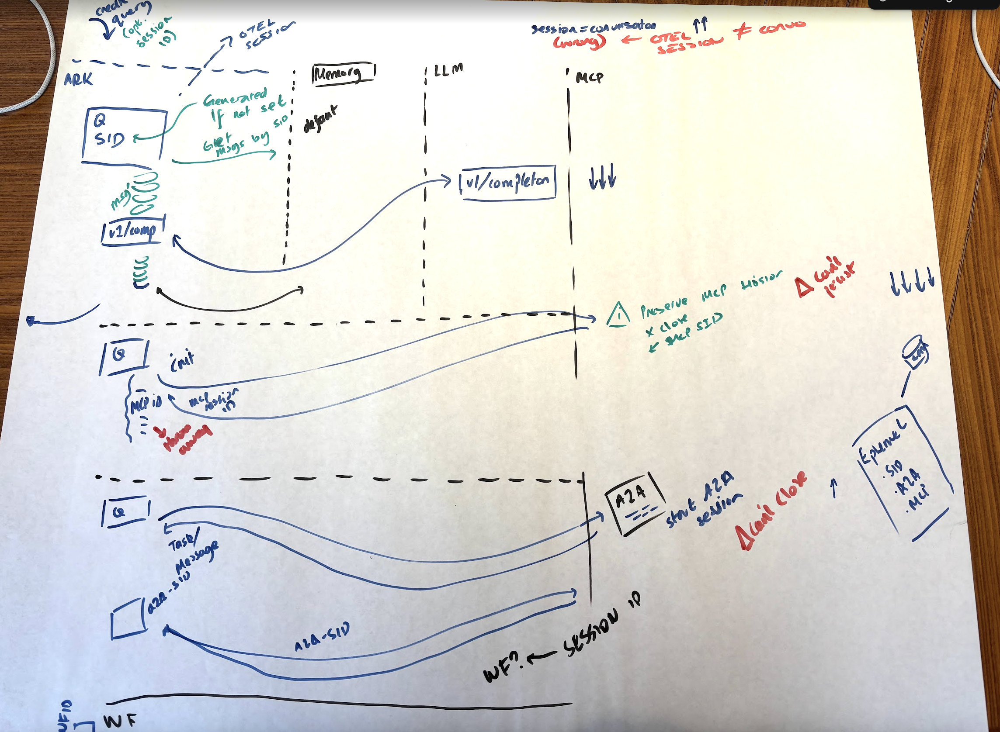
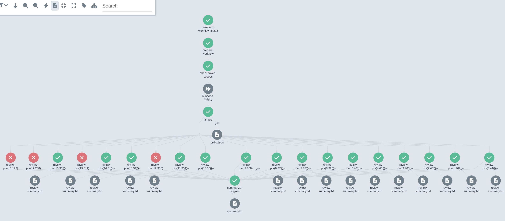

# Sessions and Streaming




<!-- vim-markdown-toc GFM -->

- [Grouping Related Queries / API Calls](#grouping-related-queries--api-calls)
- [Session Context IDs](#session-context-ids)
- [This in K8S](#this-in-k8s)
- [Conversation IDs](#conversation-ids)
- [Issues / Next Steps?](#issues--next-steps)
- [For later?](#for-later)

<!-- vim-markdown-toc -->

There are currently multiple topics around session management and streaming that are all related - a single solid design for how we want to handle it will solve a bunch of stuff. Briefly, here are the issues or opportunities:

1. Issue: We need to be able to link together related queries for analysis and telemetry purposes (essentially, 'Correlation ID')
2. Issue: We have a very ambiguous 'Session ID' which is conflated with 'Conversation ID'
3. Issue: We need to link related queries / work for Composer, consistently
4. Issue: There is an implicit 'MCP Session ID' which is used but not documented and could be confused with 'Session ID'
5. Issue: There is an 'A2A Context ID' that is also essentially a Session ID

## Grouping Related Queries / API Calls

In a workflow, there will be many queries / API calls / etc. We want to be able to link them together (e.g a bit like a correlation ID):



All of these calls are useful to relate:

- HTTP calls
- MCP calls
- LLM calls / agent calls

And useful to link the queries together. OTEL lets you specify a session ID

## Session Context IDs

It is idiomatic (MCP session ID, A2A Context ID, [Responses/Conversation API IDs](https://platform.openai.com/docs/guides/conversation-state?api-mode=responses) that IDs related to server side state originate from the server. The owner of the state creates the ID in these cases.

This means that given that a Session ID is the one thing _we_ create in Ark, it is correct and idomatic that we choose the session ID:

```
Create Query
  Session ID (provided, or generated, in the controller)
  Session <- Query ID
  Session <- Conversation ID (ark generated in controller, but OK for it to be via responses in the future)

Call MCP 1
  MCP Session ID added to Ark Session
  Session <- MCP 1 Session ID

Call MCP 2
  MCP Session ID added to Ark Session
  Session <- MCP 2 Session ID

Call A2A 1
  A2A Context ID and Task ID added to Ark Session
  Session <- A2A Context ID
  Session <- A2A Task ID
```

This means a session is _accumulated through the query flow_ and that the session _grows over queries_. It could look like this:

```yaml
session:
  id: 123
  queries:
    - id: 1
      targets:
      - id: agent1
        conversationId: c1
        mcpSessions:
          - server1: mcp1
          - server2: mcp2
          - server3: mcp3
        a2aContexts:
          - context`: a2a1
            task: task1
      - id: q2
        conversationId: cX
        mcpSessions:
          - server1: mcp1
          - server2: mcp2
          - server3: mcp3
        a2aContexts:
          - context`: a2a1
            task: task1
  metadata: [app level stuff]
```

- The session becomes the object that links all of this different _context_ together
- it is accumulative only, only added to, never mutated.
- it only needs to contain ids - the actual entities are typically elsewhere (A2A tasks, conversations in memory, etc)

Ideally:

```
PATCH? PUT? /sessions/123
{
  new: field
}
```

## This in K8S

- Session IDs are generated by Ark: therefore OK to have in the query, or defaulted.
- Almost all other IDs are returned by servers - therefore they are _state_ not _spec_.
- Your `state` gives the IDs back to the caller - the caller can then choose to use those IDs in later queries/calls, to disambiguate between state - use annotations? Otherwise the fact that for a _new_ query you could have convo ID `setByUser` but you'd get `state.conversationId=setByServer` looks awful / breaks idioms

## Conversation IDs

Conversation IDs are totally separate to session ids - a session could have many conversations, or not really use any.


## Issues / Next Steps?

**CLI**

- [ ] Session ID / env var / param - we do this already for some fields so it'd be `ARK_SESSION_ID` and a `--session-id` parameter

**Sessions / Conversations**

1. [ ] Add `conversationId` to query target response state, use this as the key in `/memory`
0. [ ] Use `ark.mckinsey.com/conversation-id` annotation, use this as the key in `/memory`
0. [ ] Create the `/sessions` endpoint, with the ability to post/stream in patches, and the ability to get/stream deltas (useful for Chris?)

**Events**

1. [ ] Watch query `Events` in `ark`
2. [ ] Refactor `Events` to be textual description + json data
2. [ ] Document schema and order of `Events` so that clients know what they can see / monitor
2. [ ] Update `fark` + `ark`
1. [ ] Fire events to OTEL?
1. [ ] Watch query `Events` in Dashboard/ChatUI
1. [ ] Watch query `Events` in Dashboard/Queries
1. [ ] Stream events to `/events/queries`? Unneeded? [However, avoids rate limits and allows for offloading storage]

**A2A**

1. [ ] Create the `/a2a` endpoint, with the ability to post/stream in patches, and the ability to get/stream patches
0. [ ] Consider whether a2a task reconcillation or the stream in of patches should update the `A2ATask` or the `Query` response
0. [ ] Enable Postgres vs json storage [via connection string only, with a short example setup in the docs?]

## For later?

1. [ ] Stream MCP session ids into `/sessions`?
6. [ ] Enable Kafka vs json storage [via connection string only, with a short example setup in the docs?]
