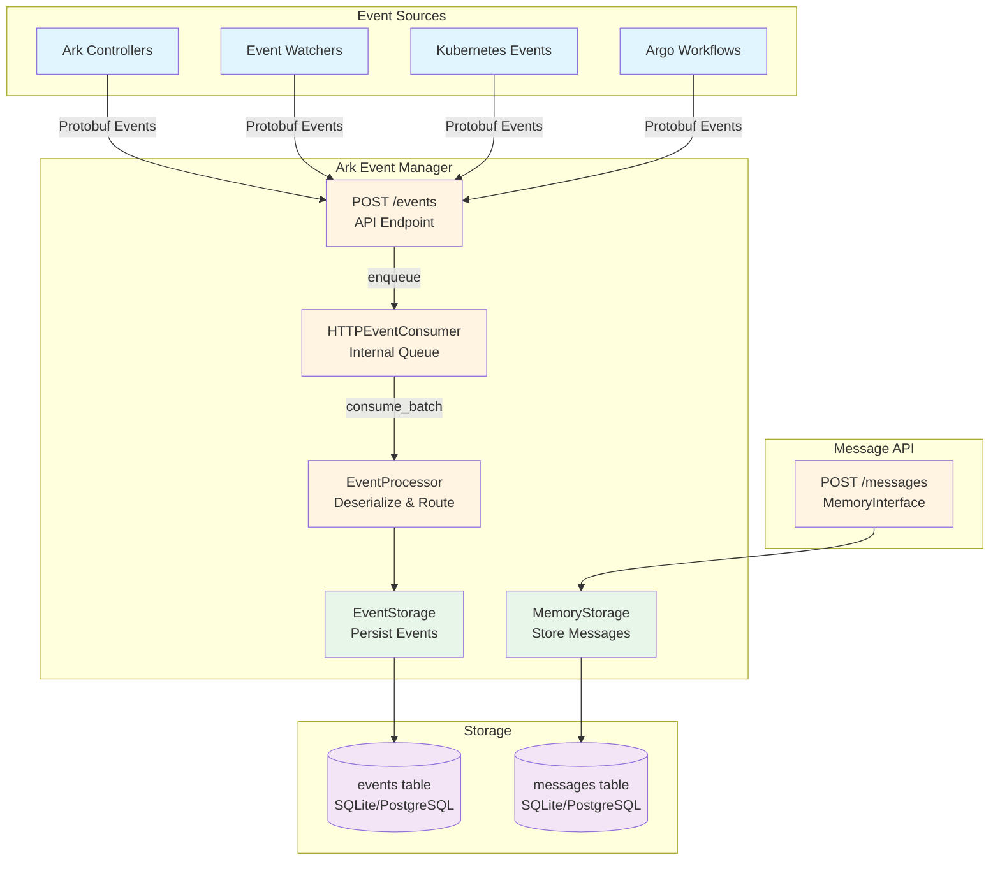
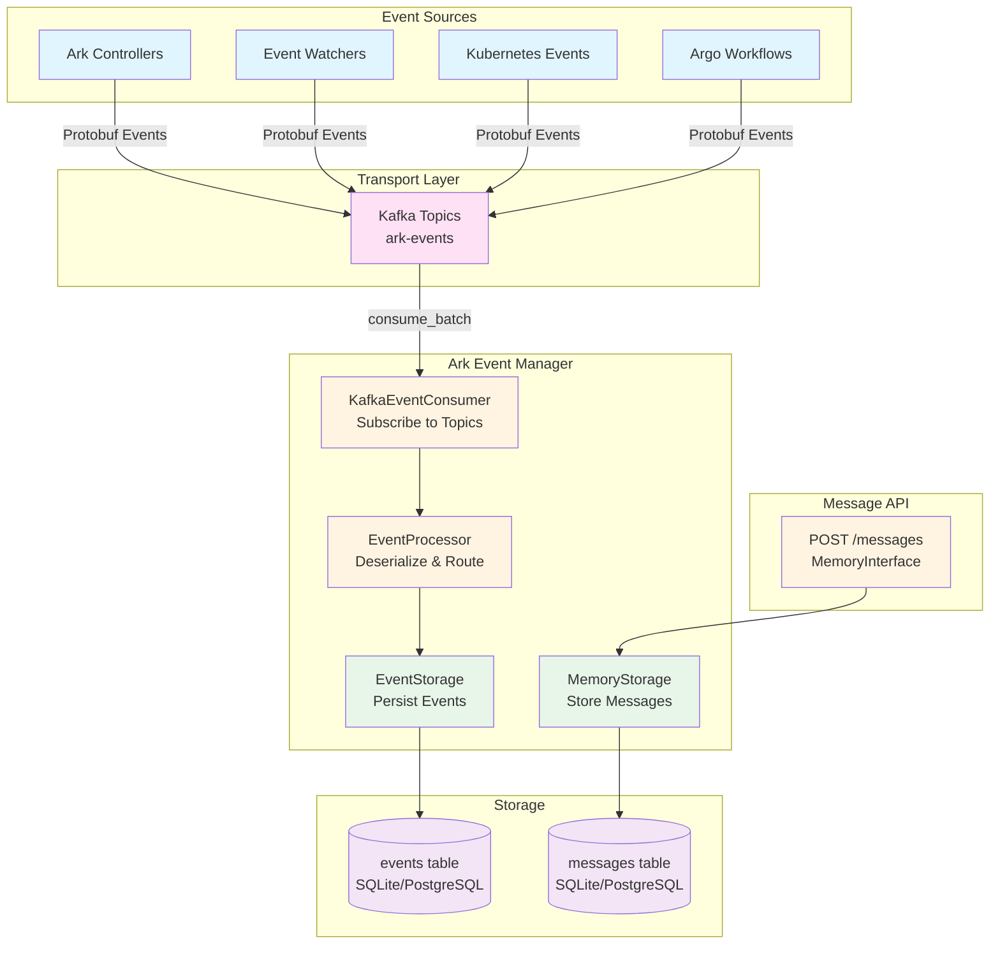
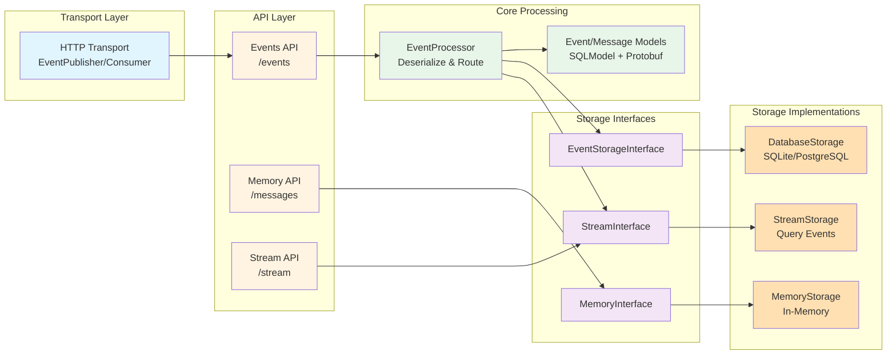
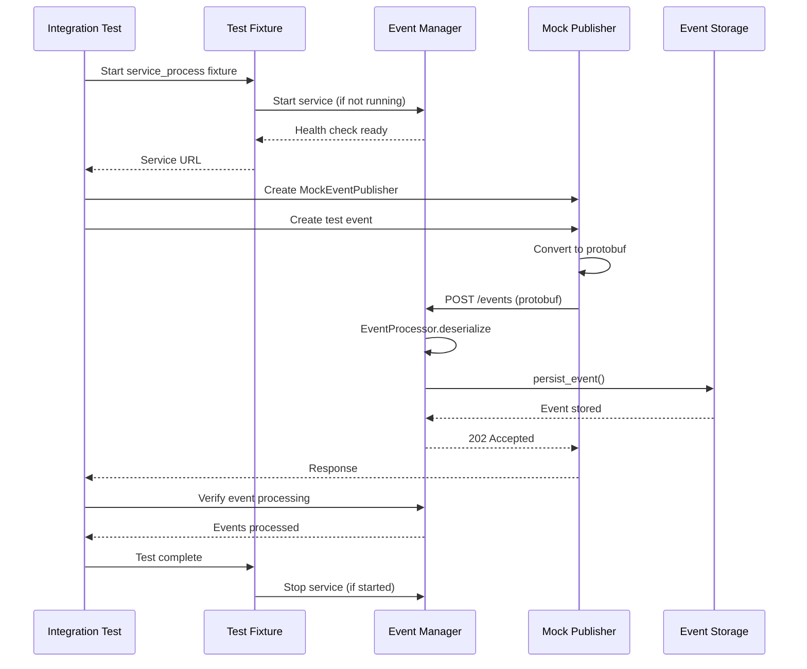

# Ark Event Manager - Architecture

## Events vs Messages: Conceptual Overview

### Events (System Telemetry)

**Purpose**: Track what happened in the system for observability, debugging, and analytics.

**Characteristics**:
- Structured schema with metadata (severity, type, subtype, source_type, source)
- Represent system state changes and operations
- Examples:
  - `type="query"`, `subtype="execution_start"` - Query execution began
  - `type="workflow"`, `subtype="succeeded"` - Workflow completed successfully
  - `type="pod"`, `subtype="log"` - Pod log entry
  - `type="error"`, `subtype="model_timeout"` - Error occurred

**Source**:
- Protobuf Event messages from Ark controllers
- Kubernetes events (via watchers)
- Argo Workflow events
- System services

**Storage**:
- `events` table (SQLModel `Event`)
- All events are persisted for querying and analysis
- Can be queried by correlation_id, type, timestamp, etc.

**API**:
- `POST /events` - Ingest events (protobuf format)
- Events flow through the event processor pipeline

### Messages (Conversation Content)

**Purpose**: Store conversation/chat history for agent context and memory.

**Characteristics**:
- Simple schema: session_id, query_id, message_data
- Represent user-assistant conversation turns
- Examples:
  - `{"role": "user", "content": "What is the weather?"}`
  - `{"role": "assistant", "content": "The weather is sunny."}`

**Source**:
- **Direct API**: `POST /messages` (MemoryInterface)

**Storage**:
- `messages` table (SQLModel `Message`)
- Organized by session_id and query_id
- Used for conversation context retrieval

**API**:
- `GET /messages?session_id=<id>` - Get conversation history
- `POST /messages` - Add conversation messages

## Data Flow

### Current Implementation (HTTP Transport)



### Future: Kafka Transport

With Kafka, the entry point would be **Kafka topics**, not POST `/events`:



**Note**: POST `/events` could optionally remain as a bridge endpoint that publishes to Kafka, but it would not be the primary entry point.

## Component Architecture



## Integration Test Flow



## Sessions and Correlation IDs

### Session Context

Events can be grouped together using **correlation IDs** (stored in the `correlation_id` field) to link related queries, API calls, and operations across the system. This enables:

- **Query Analysis**: Link all events from a single query execution
- **Workflow Tracking**: Track events across multiple related queries in a workflow
- **Telemetry**: Group events for observability and debugging

### Session ID vs Correlation ID vs Conversation ID

- **Session ID**: Ark-generated identifier that accumulates context across queries (MCP sessions, A2A contexts, conversation IDs). Managed by the Ark controller.
- **Correlation ID**: Used in events to link related operations. Can be set to a session ID, query ID, or any identifier that groups related events.
- **Conversation ID**: Separate from session IDs - used for conversation/message context. A session can have many conversations.

### Event Correlation

Events include a `correlation_id` field that can be used to:
- Link events from the same query execution
- Group events by session ID
- Track events across related operations

Example event correlation:
```python
# Events from the same query execution
Event(correlation_id="query-123", type="query", subtype="execution_start")
Event(correlation_id="query-123", type="query", subtype="execution_complete")
Event(correlation_id="query-123", type="workflow", subtype="succeeded")

# Events from the same session
Event(correlation_id="session-456", type="query", subtype="execution_start")
Event(correlation_id="session-456", type="mcp", subtype="call_complete")
Event(correlation_id="session-456", type="a2a", subtype="task_started")
```

### Streaming Events

Events can be streamed to clients for real-time monitoring:
- **HTTP/SSE Streaming**: Compatible with K8s WATCH protocol
- **Query-based Filtering**: Stream events by correlation_id, type, or other filters
- **Replay Capability**: Stream events from a specific timestamp

For more details on sessions and streaming design, see the [Sessions and Streaming Design Document](../../../docs/designs/sessions-and-streaming.md) (PR #446).

## Key Design Decisions

1. **Separation of Concerns**: Events (observability) and Messages (conversation) are stored separately
2. **Single Entry Point**: Messages arrive via direct HTTP API only (simpler, clearer separation)
3. **Event-Driven**: System telemetry flows through the event system
4. **Backward Compatible**: Direct message API maintains compatibility with ark-cluster-memory
5. **Correlation Support**: Events support correlation_id for linking related operations
6. **Streaming Ready**: Architecture supports event streaming for real-time monitoring

